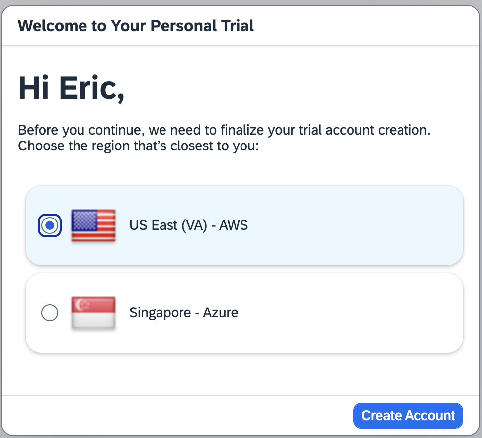

# AD181 | Develop applications and processes with SAP Build and Joule

## Description

This repository contains the material for the SAP TechEd 2024 session [AD181 | Develop applications and processes with SAP Build and Joule](https://www.sap.com/events/teched/virtual/flow/sap/te24/catalog/page/catalog/session/1722394882270001djar).  

## Overview

In this hands-on tutorial you will work through a set of exercises that highlight the capabilities of **SAP Build Code** with **Joule AI copilot**. Also showcased are the integration capabilities between **SAP Build Code**, **SAP Build Apps**, and **SAP Build Work Zone, standard edition**. 

You will gain comprehensive knowledge of full-stack development, low-code development, and business site creation with SAP Build. Learn how the SAP Cloud Application Programming Model (CAP) is leveraged in a highly productive development environment with SAP Joule generative AI.

## Prerequisites

There are different prerequisites, depending on whether you're going to run through this content during an organized event (such as one of the TechEd on Tour events), or at home.

### At home

This tutorial puts all of the SAP Build tools together for an end-to-end solution. This requires setting up each of the SAP Build tools in a SAP BTP trial account.

1. You have an SAP BTP Trial account [Get a Free Account on SAP BTP Trial](https://developers.sap.com/tutorials/hcp-create-trial-account.html). Note that you will need your user name and password later in this tutorial.
> [!IMPORTANT]
> **You must create your trial account in the US East (VA) - AWS zone (US10).**   &nbsp;   &nbsp;
> 
2. You have setup SAP Build Code: [Setup SAP Build Code in SAP BTP](https://developers.sap.com/tutorials/build-code-setup.html)
3. You have setup SAP Build Apps: [Set Up SAP Build Apps on SAP BTP Trial Account](exercises/sba-install/)

### Organized event

For running through this content in a workshop at an organized event, there is an environment already set up and configured for you. There are instructions on how to log on, and requirements for how you should name your project.

This workshop should be run in a private (or incognito) browser to avoid login conflicts with other sessions or SAP accounts. 

The Google Chrome browser is recommended.

It is recommended that you clear your browser cache with **CTRL-SHIFT-DELETE** (PC) or **COMMAND-SHIFT-DELETE** (Mac).

#### Logging on

You will be given a 3-digit user number at the start of the workshop. This number will be used for your unique user ID and password. Your instructor will share the format for the user ID and password. Note: you do not need to log into Github.

<https://lcapteched.eu10.build.cloud.sap/lobby>

> [!IMPORTANT]
> The user name has a 4-digit user number (with a leading 0), and the password has a 3 digit number.

> [!IMPORTANT]
> When saving application artifacts, please add your user number to the project name. For example, when creating the SAP Build Code project "customer_loyalty" be sure to give the project a unique name such as "customer_loyalty_xxx" (using your user number). This will help you quickly identify your project as there are many participants creating projects with the same name.

## Exercises

Begin your exercises here. At the end of each section, there is a link to continue to the next section.

- [Start Here](exercises/ex0/)
- [SAP Build Code and Joule Copilot](exercises/ex1/)
    - [Create Project](exercises/ex1.1/)
    - [Create Data Entities with Joule](exercises/ex1.2/)
    - [Create Sample Data with Joule](exercises/ex1.3/)
    - [Create Backend Logic with Joule](exercises/ex1.4/)
    - [Add External Data Resource](exercises/ex1.5/)
    - [UI Application](exercises/ex1.6/)
    - [Preview](exercises/ex1.7)
- [Prepare & Deploy CAP Application](exercises/ex2/)
    - [Preparation](exercises/ex2/)
    - [Deployment](exercises/ex2.1/)
- [SAP Build Apps](exercises/ex3/)
    - [Create Project from Template](exercises/ex3.1/)
    - [Authentication and Data Integration](exercises/ex3.2/)
    - [New Purchase Page - Logic for Data Variables](exercises/ex3.3/)
    - [Redeem Points Page - Logic for Data Variables](exercises/ex3.4/)
    - [Logic for UI Components](exercises/ex3.5/)
    - [Preview and Test](exercises/ex3.6/)
- [(Optional) SAP Build Work Zone, standard edition](exercises/ex4/)
    - [Deploy SAP Build Apps to Work Zone](exercises/ex4.1/)
    - [Configure a business site and access your app](exercises/ex4.2/)

## Contributing
Please read the [CONTRIBUTING.md](./CONTRIBUTING.md) to understand the contribution guidelines.

## Code of Conduct
Please read the [SAP Open Source Code of Conduct](https://github.com/SAP-samples/.github/blob/main/CODE_OF_CONDUCT.md).

## How to obtain support

Support for the content in this repository is available during the actual time of the online session for which this content has been designed. Otherwise, you may request support via the [Issues](../../issues) tab.

## License
Copyright (c) 2024 SAP SE or an SAP affiliate company. All rights reserved. This project is licensed under the Apache Software License, version 2.0 except as noted otherwise in the [LICENSE](LICENSES/Apache-2.0.txt) file.
