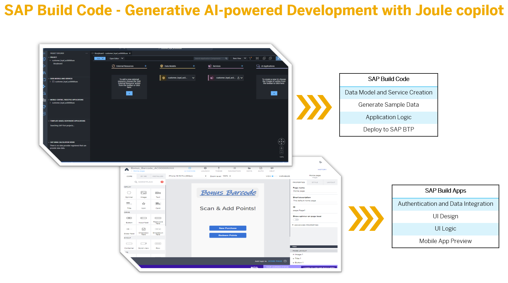
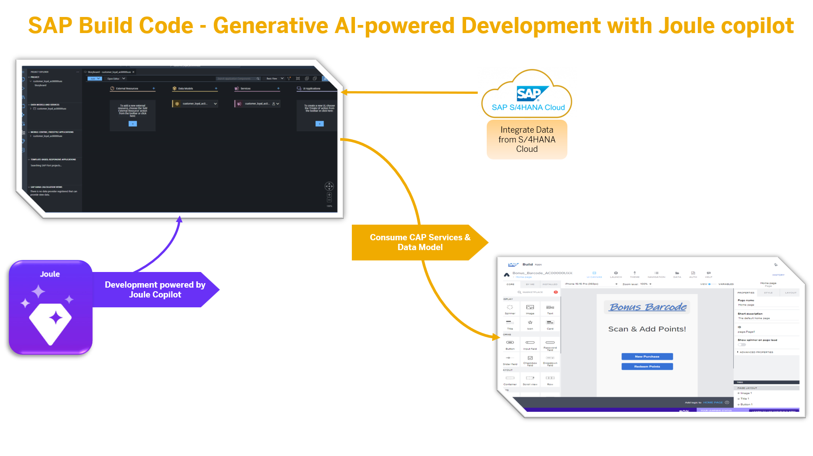

# Tutorial Overview

# If you need help during the workshop, or need more than 3 weeks to complete the workshop, please email buildcode@sap.com

In this hands-on tutorial you will work through a set of exercises that highlight the capabilities of SAP Build Code with Joule AI copilot. Also showcased are the integration capabilities between SAP Build Code, SAP S/4HANA Cloud and SAP’s Low-code/No-code development environment, SAP Build Apps. You will also (optionally) deploy your app into SAP Build Work Zone, standard edition with a SAP HANA Cloud database instance.

The business scenario for this exercise is focused on a points-based
customer loyalty programme with data related to Customers, Purchases and
Redemptions. Within the Purchases area we will integrate our product
data from SAP S/4HANA Cloud. Using SAP Build Code and the Joule AI
copilot you will create data entities and backend logic. You will then
use SAP Build Apps to create a UI application to consume the data. Finally, you will deploy
your app to SAP Build Work Zone, standard edition.

<!-- TODO add work zone image -->

## Goal

1. To display the power of Generative AI powered Development. Joule in SAP Build Code provides the following capabilities.

    - Data Model and Service Creation

    - Sample Data

    - Application Logic

2. To demonstrate the one select deployment in SAP Build Code and integrate it to SAP Build Apps

3. Create UI extensions in SAP Build Apps

4. Use SAP Build Apps Mobile Preview

6. (optional) Deploy your solution to SAP Build Work Zone, standard edition.

<!-- TODO add work zone to image -->

## [Next Lesson ⎘](../ex1/)