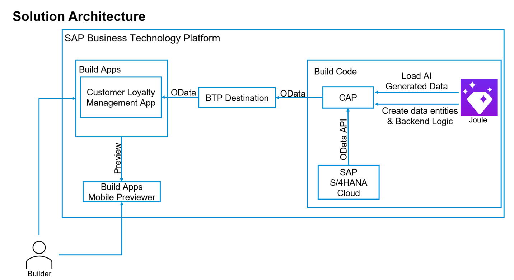

# Tutorial Overview

In this hands-on tutorial you will work through a set of exercises that highlight the capabilities of SAP Build Code with Joule AI copilot. Also showcased are the integration capabilities between SAP Build Code, SAP S/4HANA Cloud and SAP’s Low-code/No-code development environment, SAP Build Apps. You will also implement an approval workflow with SAP Build Process Automation, and deploy your app into SAP Build Work Zone, standard edition.

The business scenario for this exercise is focused on a points-based
customer loyalty programme with data related to Customers, Purchases and
Redemptions. Within the Purchases area we will integrate our product
data from SAP S/4HANA Cloud. Using SAP Build Code and the Joule AI
copilot you will create data entities and backend logic. You will then
use SAP Build Apps to create a UI application to consume the data, and an
approval workflow with SAP Build Process Automation. Finally, you will deploy
your app to SAP Build Work Zone, standard edition.

## Prerequisites

- Your BTP Trial Account running in US East-VA (US10)
- You trial account configured with SAP Build Work Code, SAP Build Apps, SAP Build Process Automation, and SAP Build Work Zone, standard edition.
- If you have not yet configured this environment, you will find the links at the start of this exercise, [here](../../#prerequisites).

Note: Make sure to follow the exercise documentation and use the
provided naming conventions. Otherwise, you will encounter issues.

## Goal

1. To display the power of Generative AI powered Development. Joule in SAP Build Code provides the following capabilities.

    - Data Model and Service Creation

    - Sample Data

    - Application Logic

2. To demonstrate the one select deployment in SAP Build Code and integrate it to SAP Build Apps

3. Create UI extensions in SAP Build Apps

4. Use SAP Build Apps Mobile Preview

5. Create an approval workflow in SAP Build Process Automation

6. Deploy your solution to SAP Build Work Zone, standard edition.

## [Next Lesson](../ex1/)