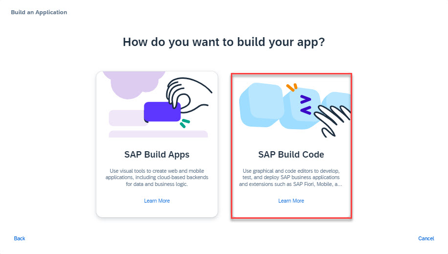

# SAP Build Code and Joule Copilot

## Create Project

**The starting point for this tutorial is the lobby of SAP Build, the
central entry point for all SAP Build products.**

1.  **Launch the SAP
    Build [Lobby](../lobbyaccess/) (if
    you are not already in the Lobby)**

2.  **Select the Create button**

3.  **Select Build an Application**

4.  **Select SAP Build Code**

5.  **Select Full-Stack Application**

6.  **On the next screen, enter the following:**

| **Input Field** | **Input Value** |
|----|----|
| **Project Name** | **Customer_Loyalty** |
| **Description** | **Customer Loyalty Program Model and Services** |
| **Dev Space** | **Select the default** |

7.  **Select the Create button.**

    - **The creation of the project can take up to 1 minute.**

8.  **Select the Customer_Loyalty project.**

9.  **You may be asked to accept a privacy statement by clicking OK.**

10.  **You might be asked to confirm the cookies settings by
    clicking OK (or Open Settings to update the settings)**

11. **SAP Build Code will be opened, based on SAP Business Application
    Studio - in the background.**

- **Please allow some time for SAP Build Code to open!**

## [Next Lesson ⎘](../ex1.2/)