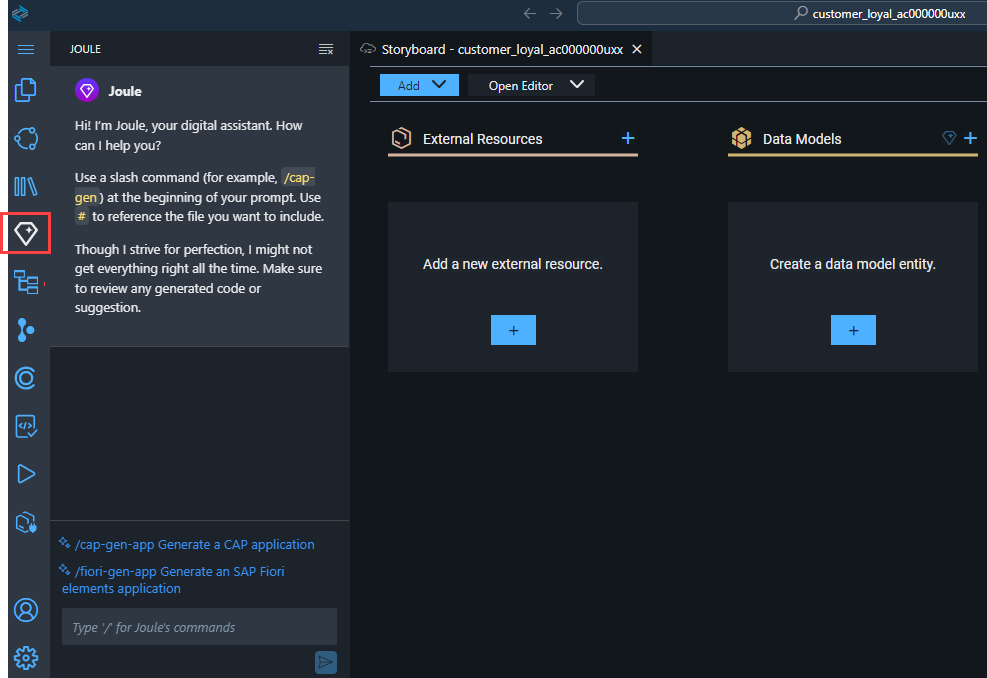
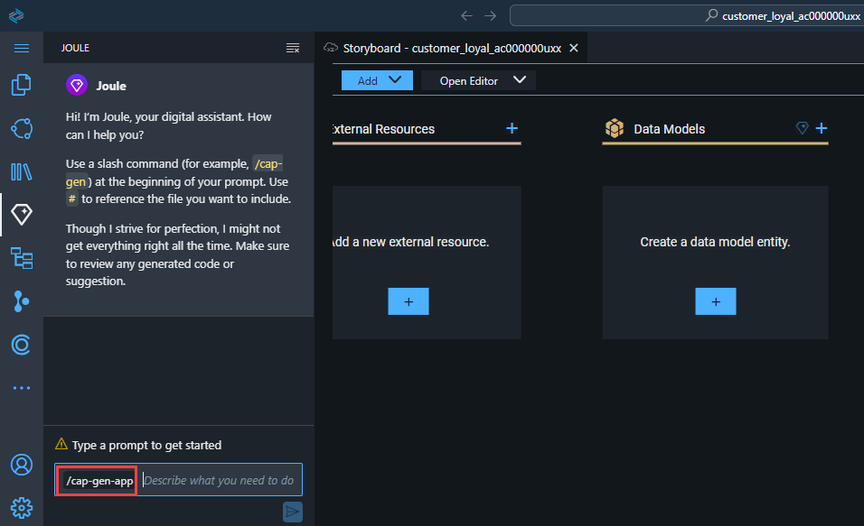
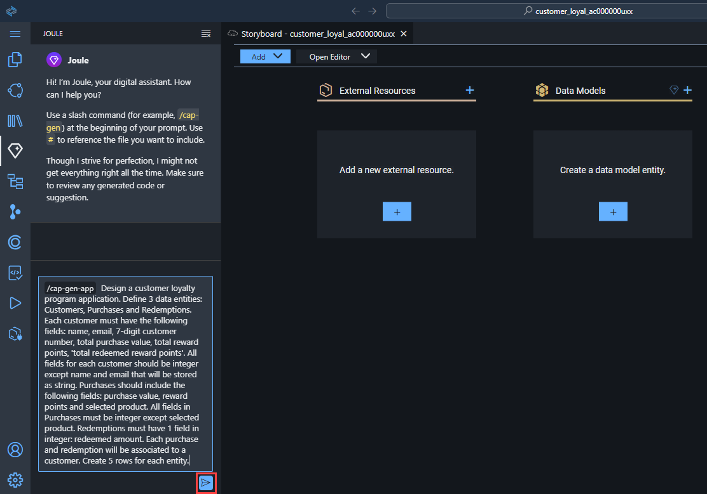
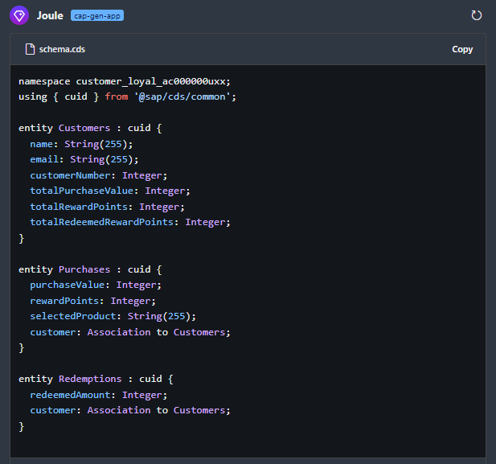
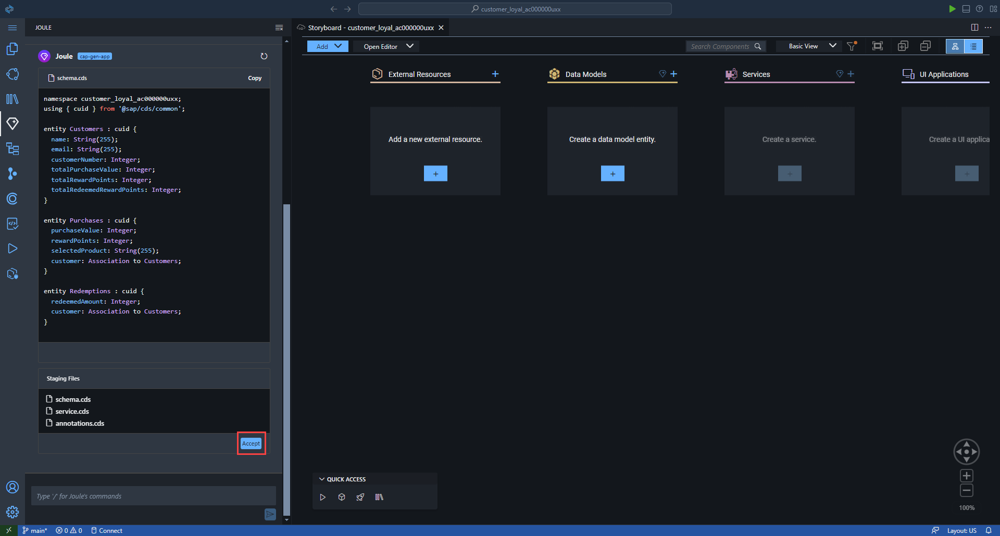
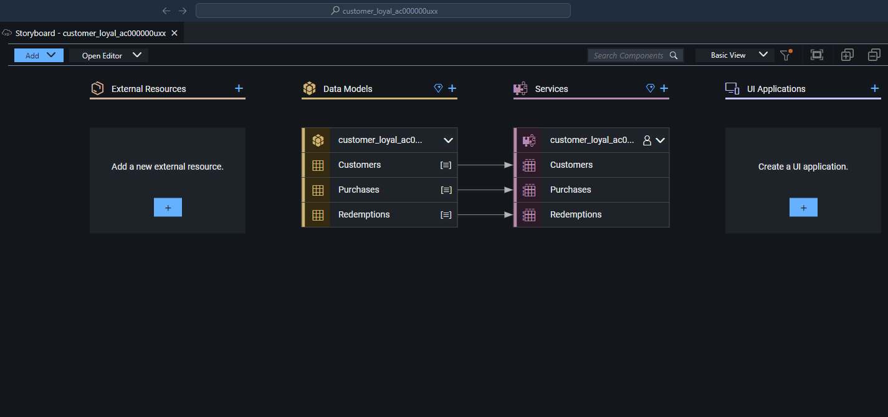

# SAP Build Code and Joule Copilot

## Create Data Entities with Joule

In this lesson, we will create the data model and the services for the
customer loyalty program application.

We could create the data model visually from the Storyboard or by
writing the code manually. However, we are going to use the generative
AI capabilities of Joule and SAP Build Code to generate the code. Thus,
significantly reducing the time and effort required to develop the
customer loyalty program application.

1.  Launch the Joule digital assistant.

    - Please wait for the digital assistant to open. If it fails to open
      then please refresh your browser.



2.  Please ask Joule to generate a CAP application by
    entering /cap-gen-app into the prompt.



3.  Generate the data model and services by copying and pasting the
    prompt into the box where it says ‘Describe what you need to do’.

```
Design a customer loyalty program application. Define 3 data entities:
Customers, Purchases and Redemptions. Each customer must have the
following fields: name, email, 7-digit customer number, total purchase
value, total reward points, ‘total redeemed reward points’. All fields
for each customer should be integer except name and email that will be
stored as string. Purchases should include the following fields:
purchase value, reward points and selected product. All fields in
Purchases must be integer except selected product. Redemptions must have
1 field in integer: redeemed amount. Each purchase and redemption will
be associated to a customer. Create 5 rows for each entity.
```

4.  Select Generate.



5.  The code should be generated now below your prompt.



6.  Select Accept.



7.  Once the code is accepted, the update will be reflected on
    the Storyboard. Please allow up to 2 minutes for Joule to generate
    the data models and services.



## [Next Lesson ⎘](../ex1.3/)