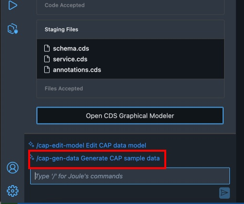
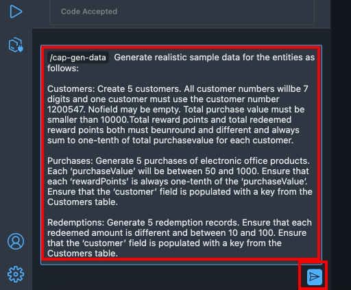
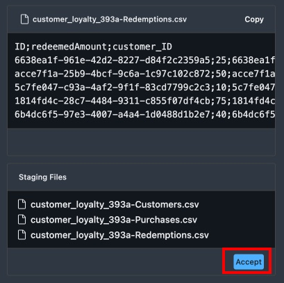
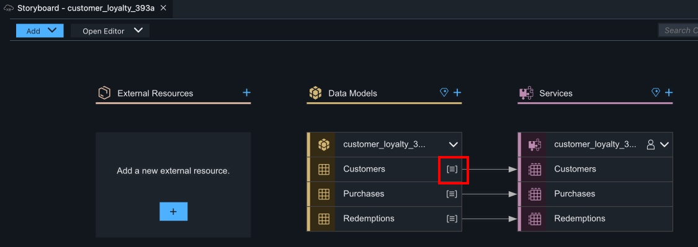
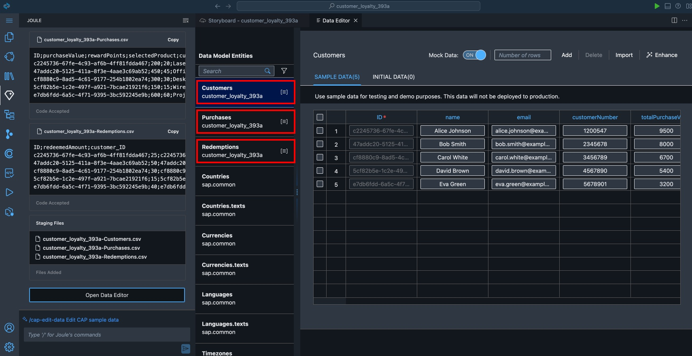

# SAP Build Code and Joule Copilot

## Create Sample Data with SAP Joule

In this lesson, we will utilise the generative AI capabilities of Joule
and SAP Build Code to generate sample data. This data will be used to
test and preview the backend service of our customer loyalty program
application.

1. In the Joule panel, select the command **/cap-gen-data**



2. Copy and paste the following Prompt into Joule and select Generate:

```
Generate realistic sample data for the entities as follows:

Customers: Create 5 customers. All customer numbers will
be 7 digits and one customer must use the customer number 1200547. No
field may be empty. Total purchase value must be smaller than 10000.
Total reward points and total redeemed reward points both must be
unround and different and always sum to one-tenth of total purchase
value for each customer.

Purchases: Generate 5 purchases of electronic office products. Each 
‘purchaseValue’ will be between 50 and 1000. Ensure that each 
‘rewardPoints’ is always one-tenth of the ‘purchaseValue’. Ensure 
that the ‘customer’ field is populated with a key from the Customers table.

Redemptions: Generate 5 redemption records. Ensure that each redeemed 
amount is different and between 10 and 100. Ensure that the ‘customer’ 
field is populated with a key from the Customers table.
```



3. Joule will take a moment and will generate CSV files containing the generated Customers, Purchases and Redemptions. Select **Accept** to add the data to your project.



4. To view the data that was added to your project, click on the data icon on one of your entities:



5. Use the Data Editor to browse the generated Customers, Purchases, and Redemptions.



## [Next Lesson ⎘](../ex1.4/)