# SAP Build Code and Joule Copilot

## Create Backend Logic with Joule

We have already created the entities, services and sample data with
Joule. In this lesson, we will add some logic to our application. We
would like to calculate the bonus points for each customer purchase.
Additionally, we want to provide the logic for customers to redeem their
bonus points.

Purchases Backend Logic

1.  In the Storyboard, select one of the entities
    under Services and Open in Graphical Modeler

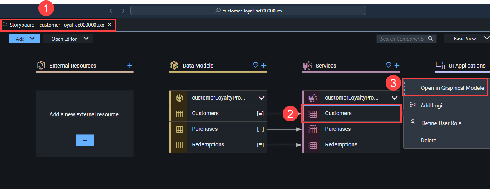

2.  Select Purchases entity by selecting the title.

    - Note: if you can not see the Purchases entity you may have to zoom
      out the view.

3.  Select Add Logic.

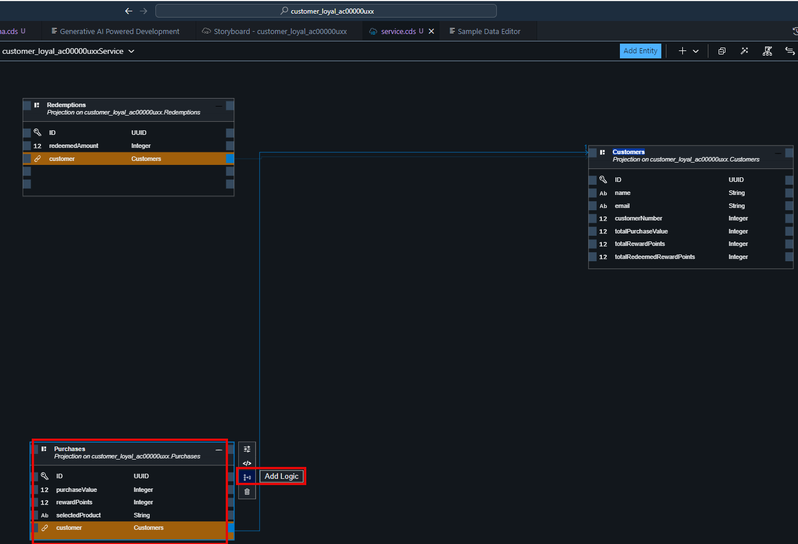

4.  Leave everything by the default value and select Add

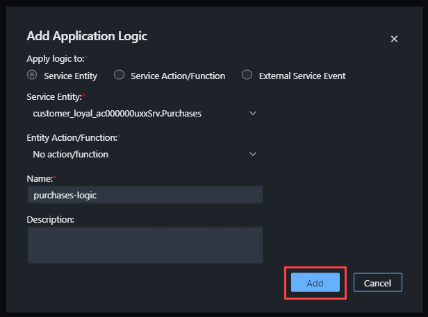

5.  Select the Standard Event Create.

    - That means this logic will be automatically executed if a new
      purchase is done.

6.  Go to Open Code Editor \> Application Logic.

    - This will open Joule again to create the logic for us.

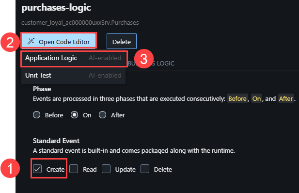

7.  Use the following Prompt in Joule to create a backend logic:

```
Reward points of each purchase will be the one-tenth of the purchase
value. Each purchase value will be added to the total purchase value of
the related customer. Each reward points will be added to the total
reward points of the related customer.
```

8.  Select Generate.

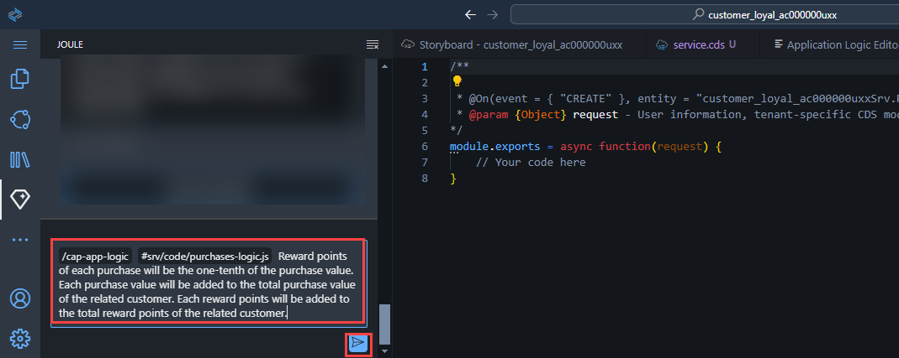

9.  Joule created the following logic:

    - Check if the customer exists

    - Calculates the rewardPoints from the purchase value

    - Updates the total purchase value and the total reward points in
      the customers entity

10. Accept the code created by Joule.

- Joule may generate different codes for the same prompt. If the code
  for the backend logic differs but achieves the same result, you can
  ignore the variation and continue working on the exercise.

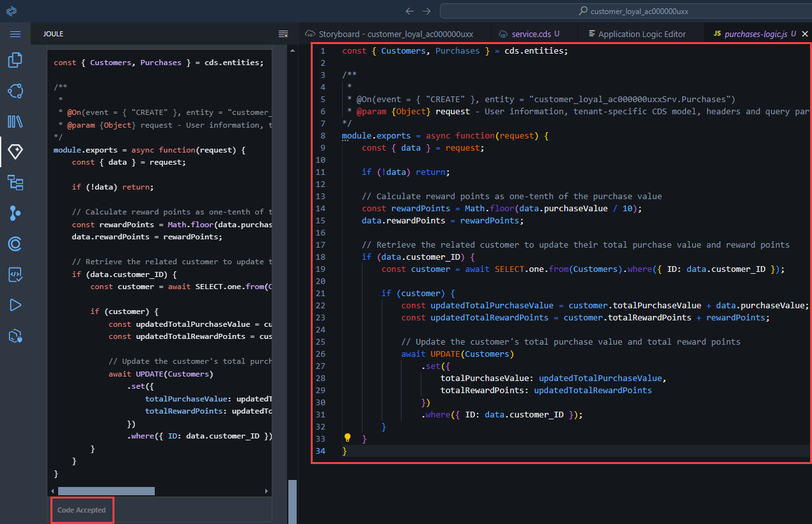

Redemptions Backend Logic

Now we continue with the Redemptions.

1.  Go back to service.cds tab.

2.  Select Redemptions entity by selecting the title.

3.  Select Add Logic.

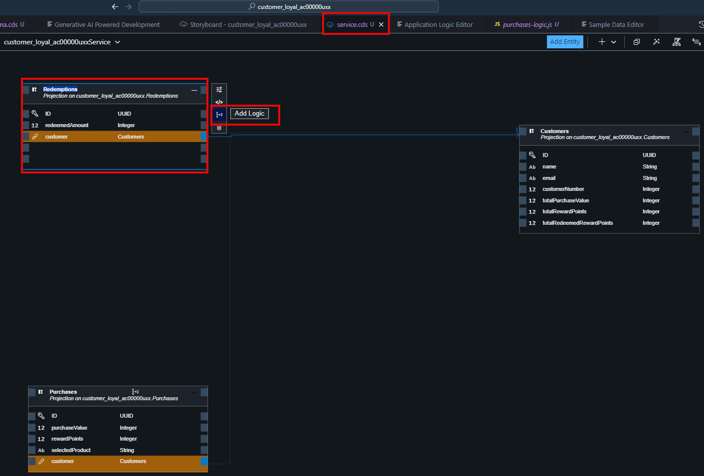

4.  Select Add.

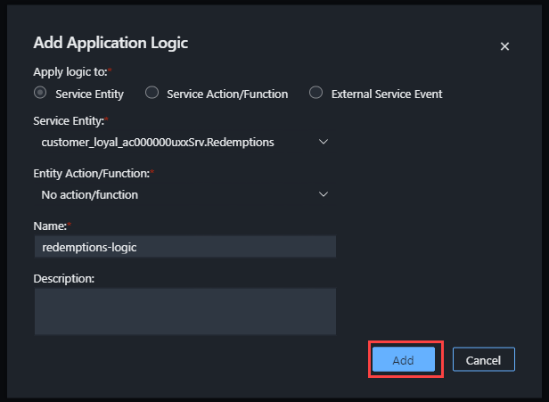

5.  Select Create.

6.  Go to Application Logic under Open Code Editor

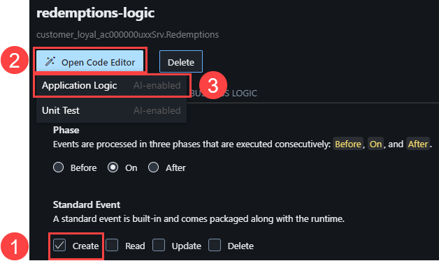

7.  Use the following Prompt in Joule to create a backend logic:

```
Deduct the redemption amount from ‘totalRewardPoints’ of the related
customer. Add the same redemption amount to the ‘totalRedeemedPoints’ of
the related customer.
```

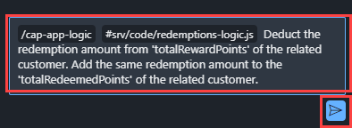

8.  Accept the code created by Joule.

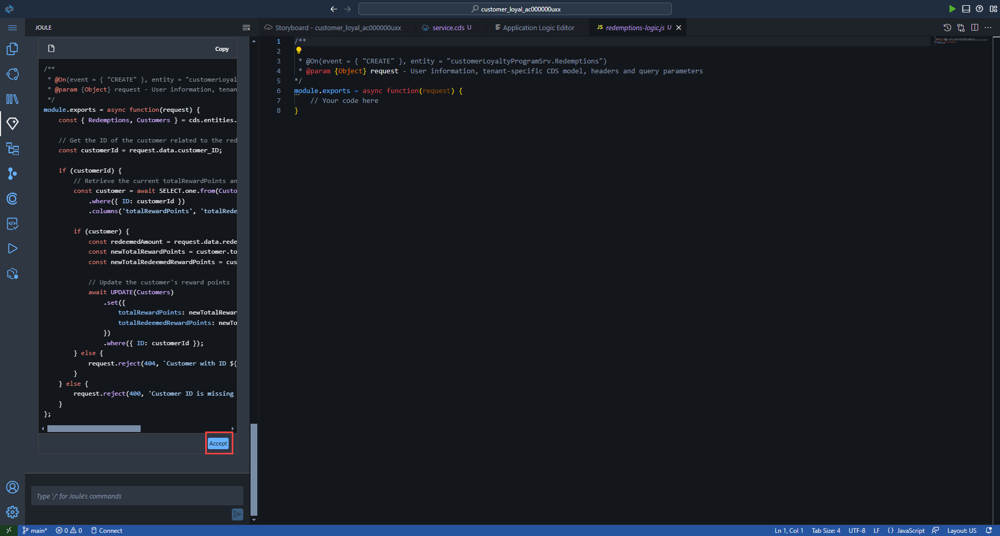

9.  Have a closer look at the generated code. It includes some logic to
    check if a customer has enough points for the redemption.

    - Joule might generate different codes for the same prompt. So, you
      might have a different code for the backend logic which is
      completely fine if it does the same job. You can ignore this and
      keep working on the exercise.

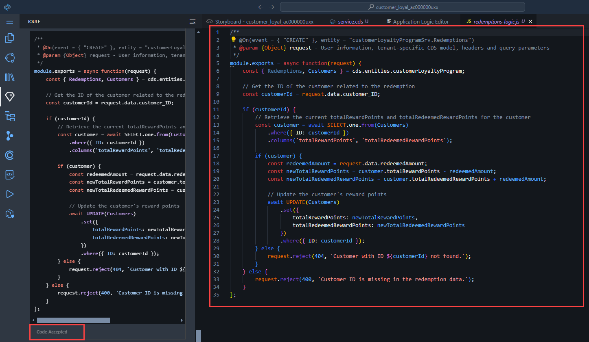

10. Go back to Storyboard and open Service Center.

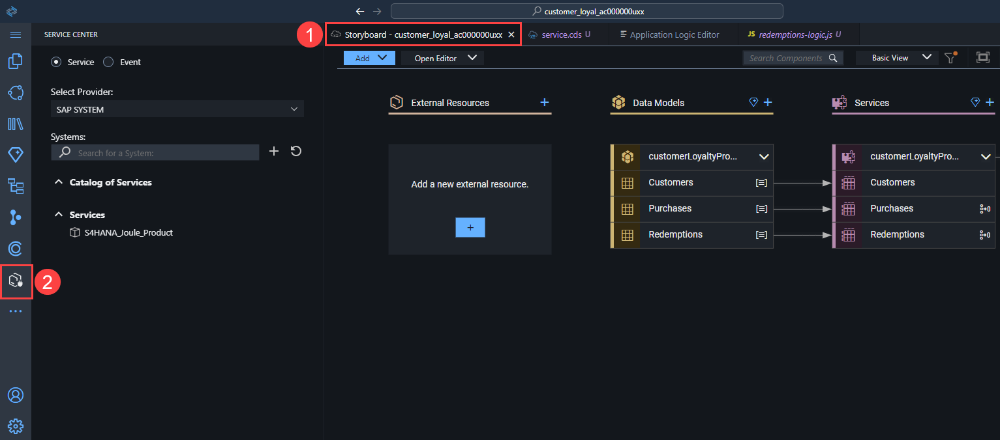

## [Next Lesson ⎘](../ex1.5/)
