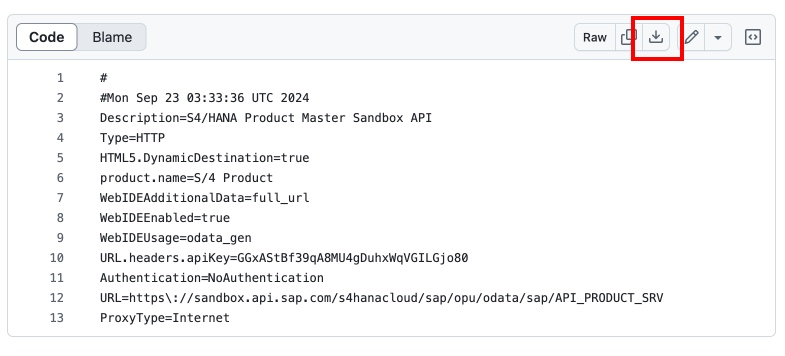
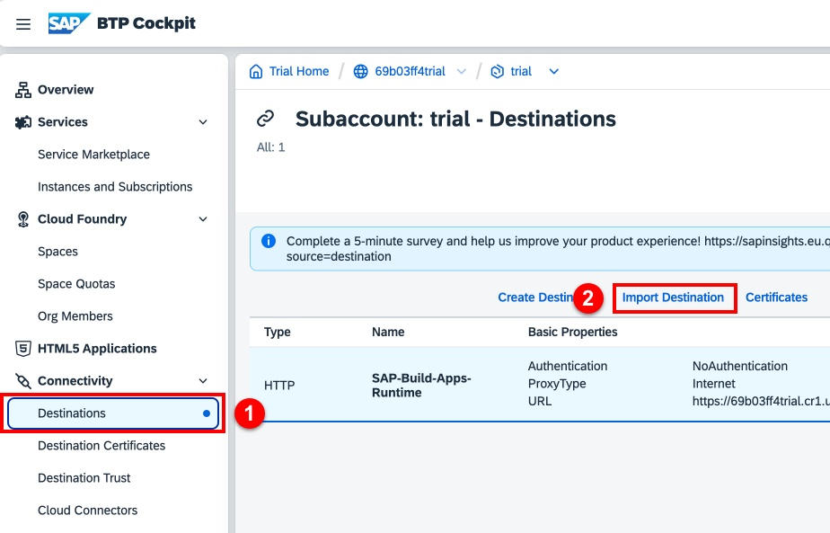
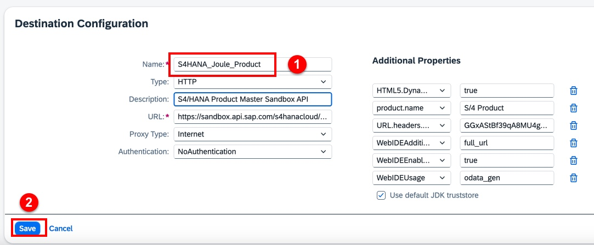
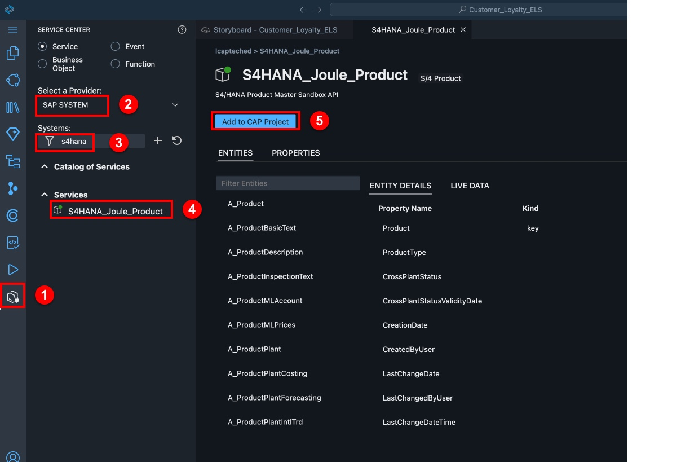
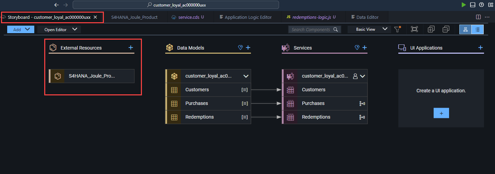
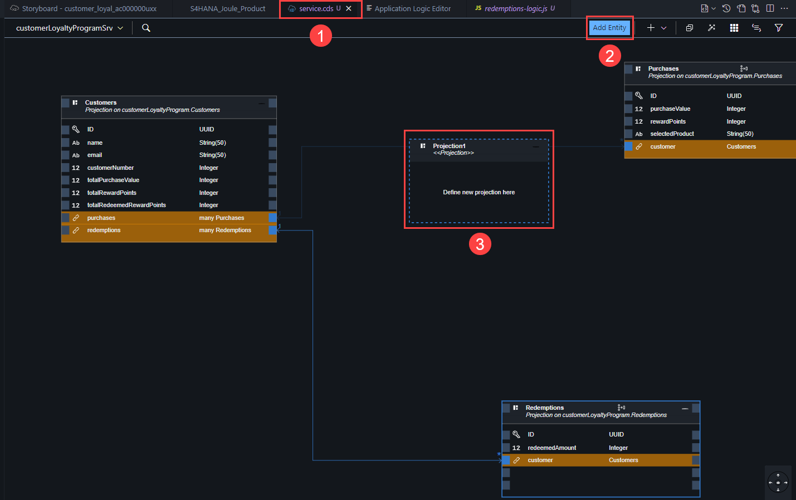
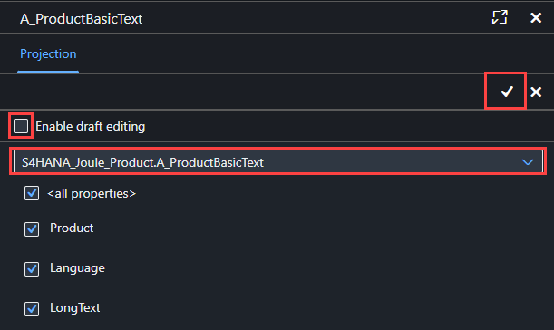

# SAP Build Code and Joule Copilot

In this lesson, we will connect to an S4/HANA system to retrieve the
product related data. To simplify the setup, we will be using a sandbox S/4 HANA instance available through the **SAP Business Accelerator Hub**, leveraging the [Product Master (A2X)/Basic Text API](https://api.sap.com/api/API_PRODUCT_SRV/overview/).

## Create a Destination for the Data Resource

We'll connect to this API through a BTP destination, following the steps below:

1. Download the destination definition to your local drive. This is a text file that contains the attributes to create the destination. [S4HANA_Joule_Product Destination](files/S4HANA_Joule_Product). After clicking the link, select the **Download raw file** button.

2. Access BTP Destinations in the subaccount. Keep your Build Code tab open, you'll return here.

- If you've closed the BTP Cockpit, see these instructions to navigate back in a new tab: [Accessing your BTP trial account, subaccount, and the SAP Build Lobby](../lobbyaccess/).

- In the BTP Cockpit, select **Connectivity > Destinations** then click **Import Destination**. Use the file picker to choose the downloaded S4HANA_Joule_Product file.

- Enter the destination name **S4HANA_Joule_Product** and click **Save** to save the new destination.

## Add External Data Resource

We'll connect to the new destination in SAP Build Code through the Service Center.

1.  In Service Center go to SAP System and find the BTP
    destination S4HANA_Joule_Product (S/4 Product).

2.  Select Add to CAP Project

3.  Go to Storyboard and check if the External Resource got updated.

Note: It may take a short time to update!

4.  Go to service.cds tab and Add Entity

    - You can drop the new entity anywhere

5.  Select the data entity: S4HANA_Joule_Product.A_ProductBasicText

    - Disable the Enable draft editing option.

6.  Select Save

## [Next Lesson ⎘](../ex1.6/)