# SAP Build Code and Joule Copilot

## UI Application

In this lesson, you’ll design a user interface to showcase and test the
content we’ve developed for the customer loyalty program application.

1.  Go back to the Storyboard and add a first UI application by
    selecting the (+)

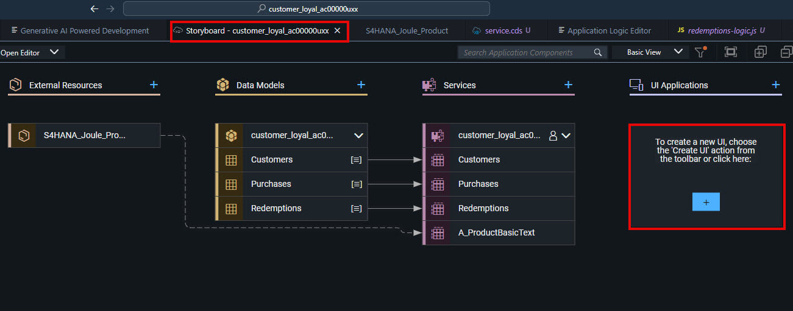

2.  We will start with the user interface for the data
    entity *Purchases*. Enter the following values:

    - Display name: Purchases

    - Description: Manage Purchases

    - Data Source: customer_loyaltySrv

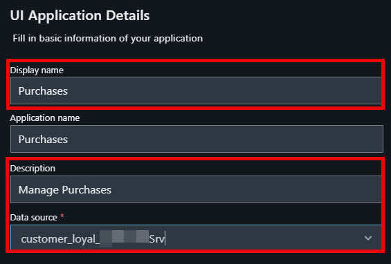

3.  Select Next

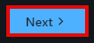

4.  Select Template-Based Responsive Application as the UI Application
    type.

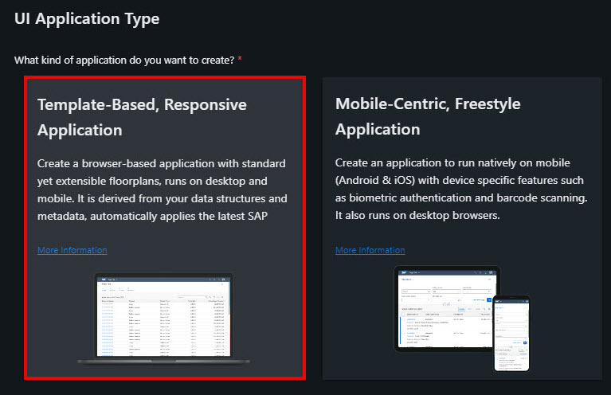

5.  Select Next

6.  Select List Report Page

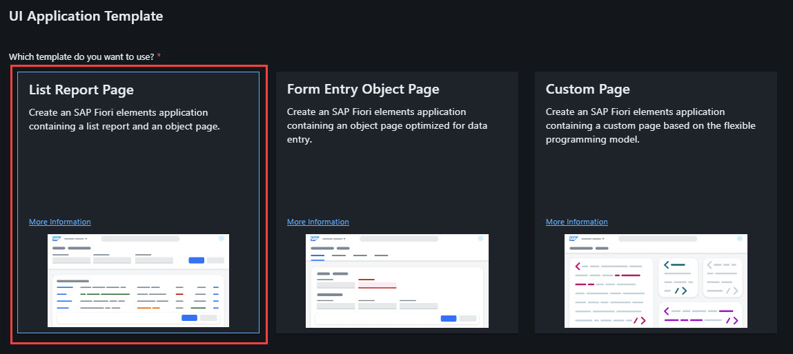

7.  Select Next

8.  Select the Purchases entity

9.  Select Finish

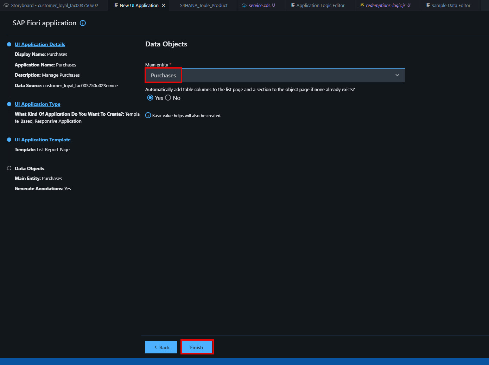

10. Close the Page Map if needed.

Repeat the same steps with the *Customer* and *Redemption* entity.

Customer:

- Display name: Customers

- Description: Manage Customers

- Data Source: customer_loyaltySrv

- UI Application type: Template-Based Responsive Application

- UI Application Template: List Report Page

- Main Entity: Customers

Wait for the UI to create.

Redemptions:

- Display name: Redemptions

- Description: Manage Redemptions

- Data Source: customer_loyaltySrv

- UI Application type: Template-Based Responsive Application

- UI Application Template: List Report Page

- Main Entity: Redemptions

Wait for the UI to create. You shoud see a message, that the files have
been generated.

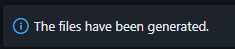

Modify the UI for the Purchases

Now we are going to modify the UI for the purchases. We will include the
products from S/4HANA as value help in the purchases and hide some
fields.

1.  Go back to the Storyboard.

2.  Select the Purchases UI and open it in the Page Map.

    - To see which is the Purchases UI, move mouse pointer over the UI
      to extend the displayed name.

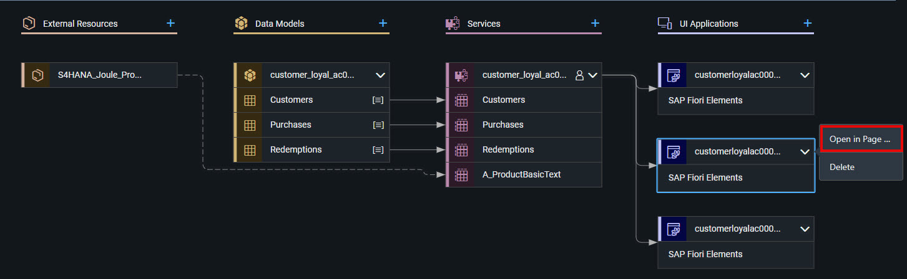

3.  We want to modify the Object page. Therefore select the edit icon

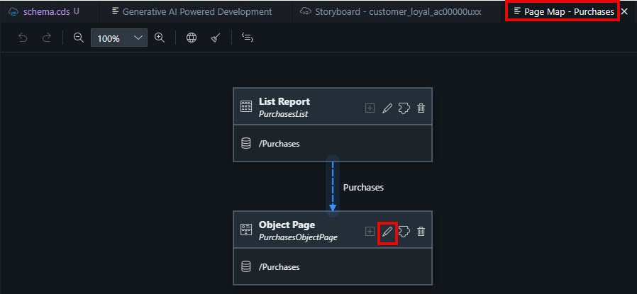

4.  In the Sections, expand General Information then expand Form and
    then expand Fields.

- Afterwards it will look like this:

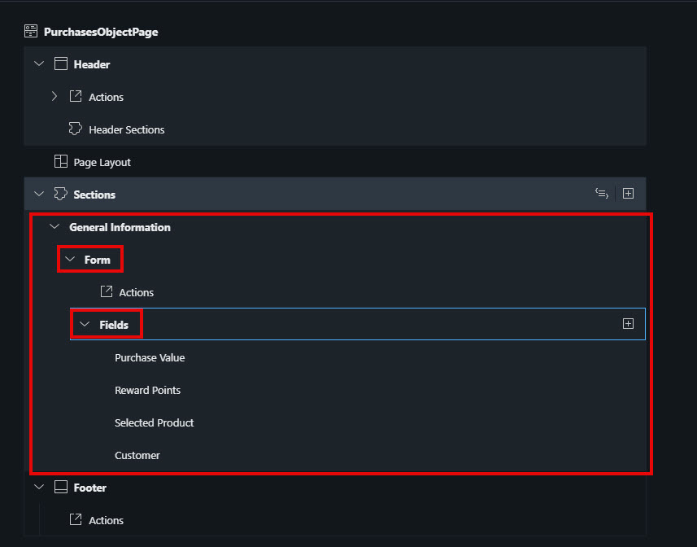

The reward points are calculated automatically by the logic Joule has
created for us.

5.  Delete the Reward Points field by pressing the trash bin icon next
    to it and Confirm the deletion.

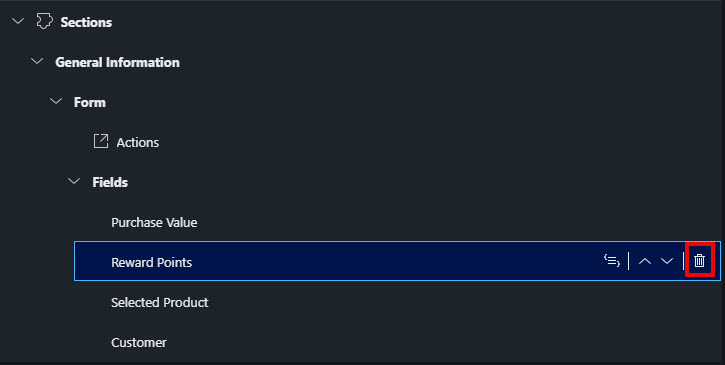

Instead we want to select the products from S/4HANA for the purchases.

6.  Select the field Selected Product and change the Display Type in the
    properties on the right side to Value Help.

Set the following:

- Label: Product

- Value Source Entity: A_ProductBasicText

- keep the rest as it is.

7.  Select Apply

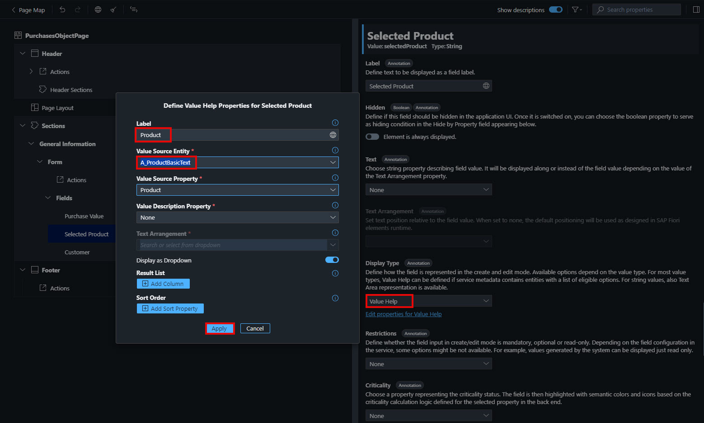

## [Next Lesson ⎘](../ex1.7/)