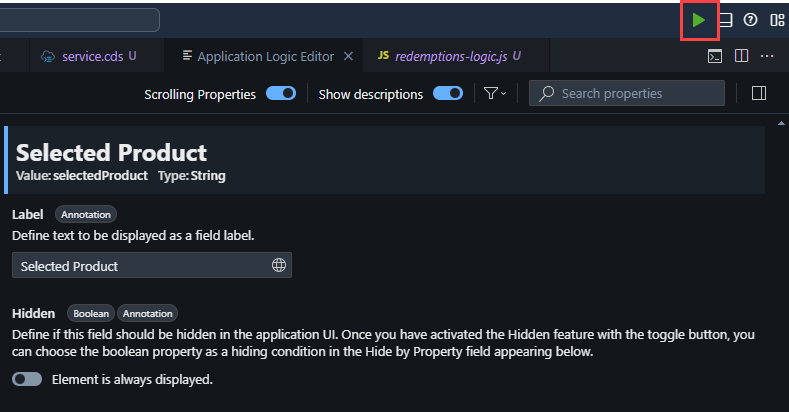
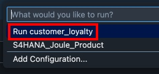
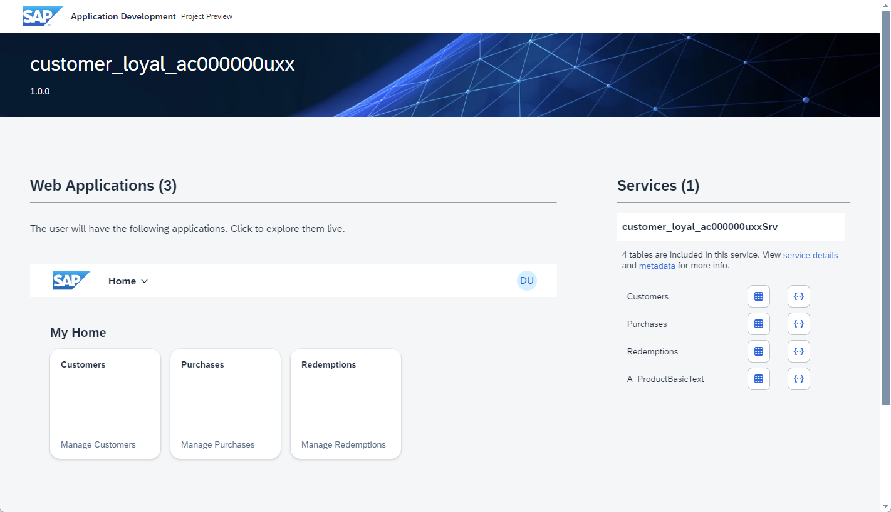
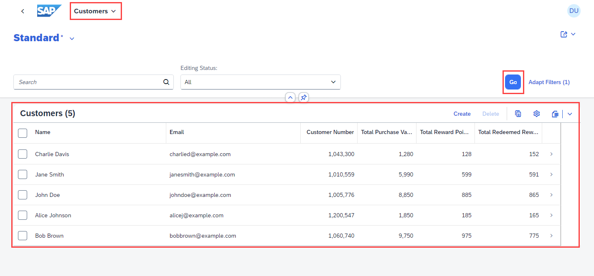

# SAP Build Code and Joule Copilot

## Preview

In this lesson, we’ll preview the customer loyalty program application
you’ve just built.

1.  To preview your application, go to the upper-right corner, and
    select Run and Debug.

2.  Select Run customer_loyalty

3.  The application’s preview is displayed.

4.  Select Go and navigate through each of the tiles
    (Customers, Purchases. Redemptions) in the Customer Loyal UI to see
    the generated data. Please note that in the application Preview not
    all functions may be available. Note that the A_ProductMaster entity may return no data, or a 404 error code. This should work correctly in the deployed application.

Congratulations! You have successfully built and previewed a CAP
application using SAP Build Code powered by Joule copilot!

## [Next Lesson ⎘](../ex2/)
