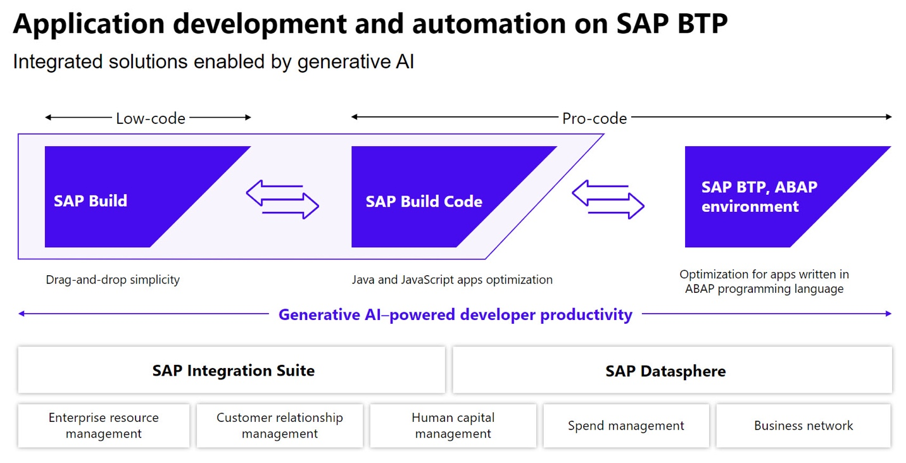

# SAP Build Code and Joule Copilot

## Overview

In this unit, we want to create a customer loyalty program application.
Customers can get bonus points for their purchases of products and can
redeem these points.

We will take advantage of generative AI powered development using Joule in SAP Build Code for:

- Data Model and Service Creation

- Sample Data

- Application Logic

## Introduction to SAP Build Code

SAP Build Code is a turn-key development environment that combines
runtime and design time capabilities with built-in solutions for DevOps
and Application Lifecycle Management.

Benefits of SAP Build Code

- Achieve a clean core by developing side-by-side extensions with SAP
  Build Code

- Optimize developer efficiency with generative AI, productivity tools,
  and application lifecycle management

- Enable developers to build and extend powerful end-to-end business
  applications with programming language of choice

- Leverage interoperability between classic development and low-code
  development tools

Key capabilities of SAP Build Code

- Differentiate cloud solution with stable and future-proof foundation,
  solution becomes future proof and works with different editions of
  S/4HANA, and quality assurance options included

- Enable developers to code faster and smarter, code generation based on
  generative AI, Ease of Application Lifecycle Management

- Application and extension development, Integrate with SAP and non-SAP
  systems

- Easy access for all types of developers with centralized Lobby, for
  Fusion Development

## [Next Lesson ⎘](../ex1.1/)