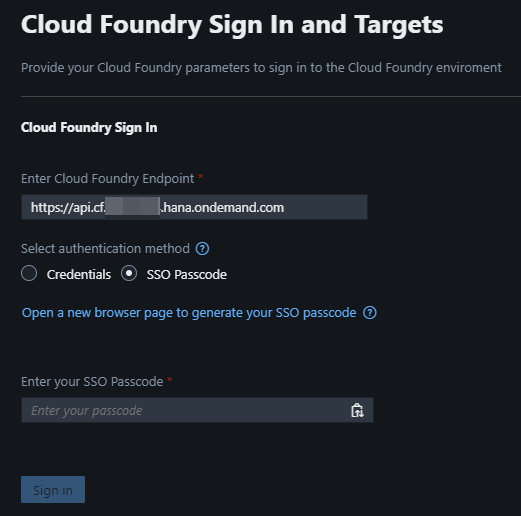
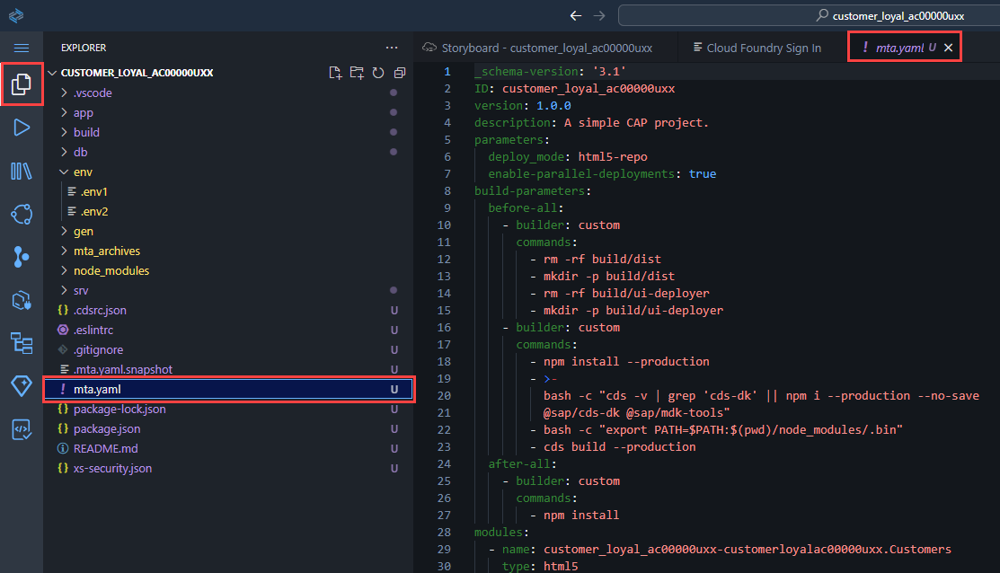
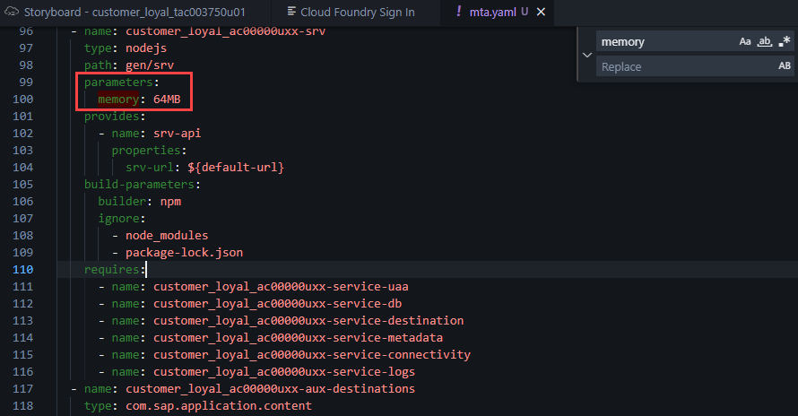
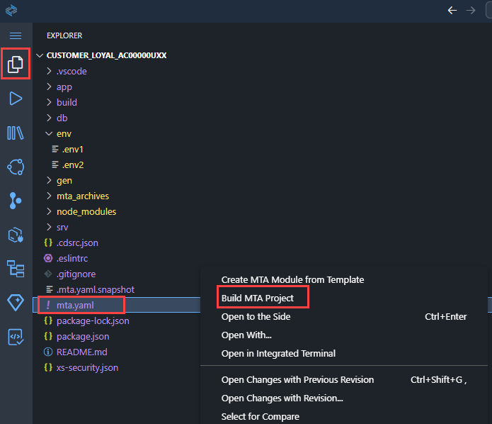
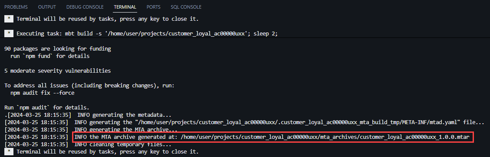
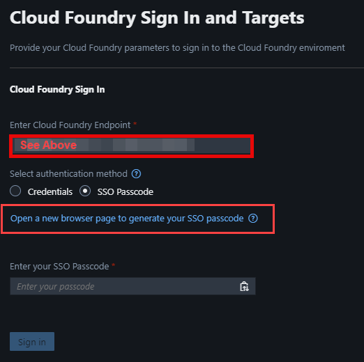
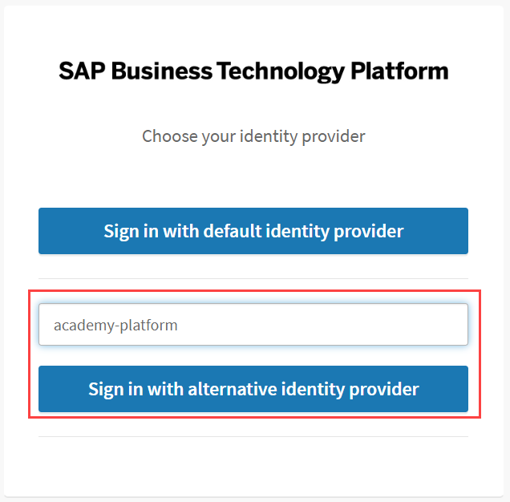
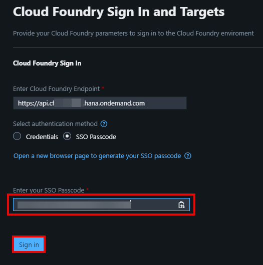
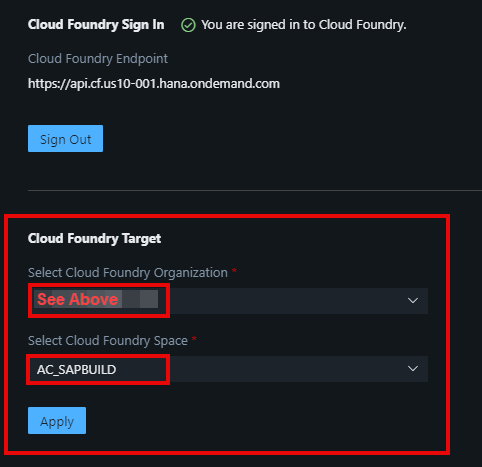
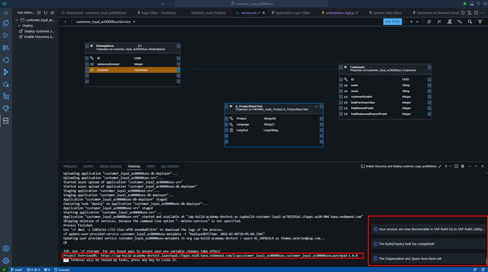

# Prepare & Deploy CAP Application

## Deployment

The final step in SAP Build Code is to deploy the application to
CloudFoundry. This process also involves the automatic creation of
destinations, enabling ODATA services to be utilised by other tools such
as SAP Build Apps.

1.  For the deployment go to Task Explorer and select the Play icon
    (Run) next to Enable Discovery and Deploy option.

    - Please be patient as this may take a few minutes.

2.  Check if the task has launched in the terminal

3.  During the deployment a new page will be opened to to sign into
    Cloud Foundry.

4.  Please note that this is a shared landscape so we need to minimise
    the size of your application. Before deploying the application to
    Cloud Foundry, we need to set the memory footprint of the
    application.

    - Select the EXPLORER icon and open the mta.yaml file.

- Search the memory parameter of your application and change the value
  to 64MB.

- Right select the mta.yaml file and select Build MTA Project

- When the job is complete, the following message is printed to
  the Terminal.

5.  Return to the Cloud Foundry Sign In and Targets page.

    - Enter the correct
      endpoint: https://api.cf.eu10-004.hana.ondemand.com

    - Select Open a new browser page to generate your SSO passcode

6.  Enter academy-platform and select Sign in with alternative identity
    provider.

7.  Copy the Temporary Authentication Code.

8.  Paste the Code and Sign In.

9.  Select the Organization and Space as specified here:

    - Organization: sap-build-code-eu10

    - Space: AC_SAPBUILD

    - Select Apply

10. After the successful deployment (May take several minutes) you will
    find the link of the deployed application in the terminal.

- Use Ctrl+click to try it out!

11. Explore the UIs that you have created

12. Select Go in each of the tiles (Customers, Purchases. Redemptions)
    in the Customer Loyal UI to see the generated data.

Congratulations! You have used the generative AI capabilities of Joule
in SAP Build Code, to create a CAP service for a customer loyalty
program application.

## [Next Lesson ⎘](../ex3/)