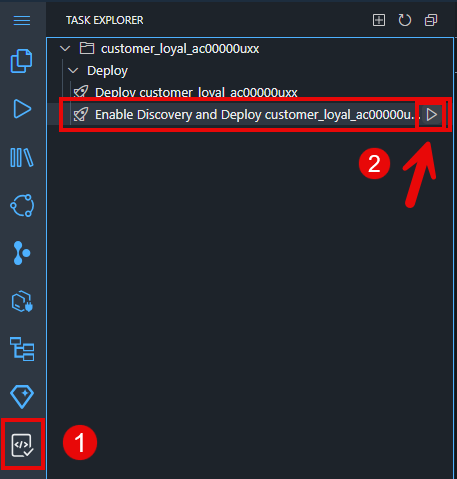

# Prepare & Deploy CAP Application

## Deployment

The final step in SAP Build Code is to deploy the application to
CloudFoundry. This process also involves the automatic creation of
destinations, enabling ODATA services to be utilised by other tools such
as SAP Build Apps.

1.  For the deployment go to Task Explorer and select the Play icon
    (Run) next to the **Enable Discovery and Deploy** option.

    - Please be patient as this may take a few minutes.

2. You will be prompted for several build configuration values:

- For UI5 Version, select the latest (currently **1.130.0**)

- For UI5 Theme, select **sap_fiori_3**

- For Vendor Dependency, select **No**.

- For Build Code Service Plan, select **No**.

3. Building the app will take a minute or two. After building the app, a new tab will be opened to to sign into Cloud Foundry for deployment.

- Select **SSO Passcode** for the authentication methods

- Click on the link **Open a new browser page to generate your SSO passcode**. A new browser tab will open.

4. If you are prompted to login using sap.ids, select **Sign in to another account** (you may not be prompted for this).

4. Log into the cloud foundry environment:

- For the origin key of the alternate identity provider, enter **lcap-platform**

- Select **Sign in with alternate identity provider**

5. Copy the Temporary Authentication Code.

6.  Paste the code and Sign In.

7. Set the Cloud Foundry deployment target:

- For Cloud Foundry Organization, select **TechEdLCAP_lcapteched**

- For Cloud Foundry Space, select **dev**

- Click **Apply**

8. After the successful deployment (may take several minutes) the terminal will indicate that the Build/Deploy task has completed and that your service is discoverable.

9. Near the bottom of the terminal, there will be a link **Project Overview URL**. This link will allow you to access the deployed application UI and services.

- Use **Ctrl+Click** (PC) or **Cmd+Click** (Mac) to try it out!

10. Explore the UIs that you have created

11. Select Go in each of the tiles (Customers, Purchases. Redemptions)
    in the Customer Loyal UI to see the generated data.

Congratulations! You have used the generative AI capabilities of Joule
in SAP Build Code, to create a CAP service for a customer loyalty
program application.

## [Next Lesson ⎘](../ex3/)