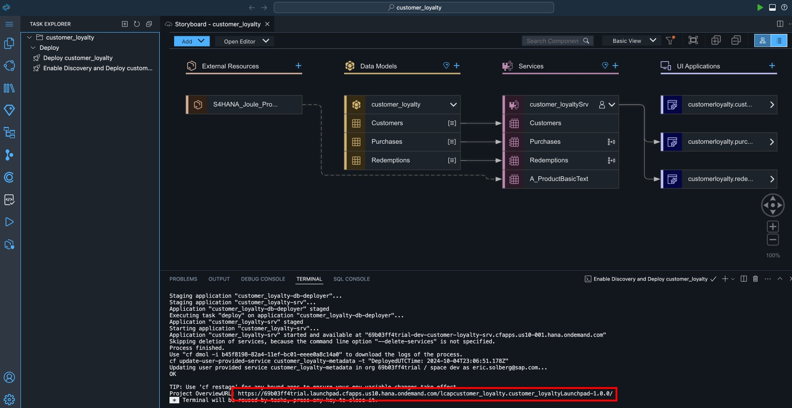

# Prepare & Deploy CAP Application

## Deployment

The final step in SAP Build Code is to deploy the application to
CloudFoundry. This process also involves the automatic creation of
destinations, enabling ODATA services to be utilised by other tools such
as SAP Build Apps.

1.  For the deployment go to Task Explorer and select the Play icon
    (Run) next to Enable Discovery and Deploy option.

    - Please be patient as this may take a few minutes.

2.  Check if the task has launched in the terminal

3.  During the deployment a new page will be opened to to sign into
    Cloud Foundry.

- Select **SSO Passcode** for the authentication methos

- Click on the link **Open a new browser page to generate your SSO passcode**. A new browser window will open.

4. Log into your account

5. Copy the Temporary Authentication Code.

8.  Paste the Code and Sign In.

9.  Select your trial Organization and Space, and click **Apply** (your organization will be different than shown here).

10. After the successful deployment (May take several minutes) you will
    find the link of the deployed application in the terminal.

- Use Ctrl+click to try it out!

11. Explore the UIs that you have created

12. Select Go in each of the tiles (Customers, Purchases. Redemptions)
    in the Customer Loyal UI to see the generated data.

13. You may also access your UI through the subaccount by selecting **HTML5 Applications** and clicking **customer_loyaltyLaunchpad**.

> [!IMPORTANT]
> When apps in a trial account are idle for some time, they may be stopped automatically. If your app seems unresponsive, you may need to restart it. To restart your app, navigate to the the subaccount and select **Cloud Foundry > Spaces**, enter the **dev** space, and check the application **customer_loyalty-srv**. If is is stopped, simply click the start button. Note that you should not restart the customer_loyalty-db-deployer app.

Congratulations! You have used the generative AI capabilities of Joule
in SAP Build Code, to create a CAP service for a customer loyalty
program application.

## [Next Lesson ⎘](../ex3/)