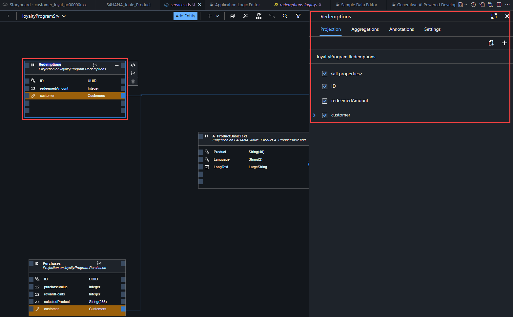
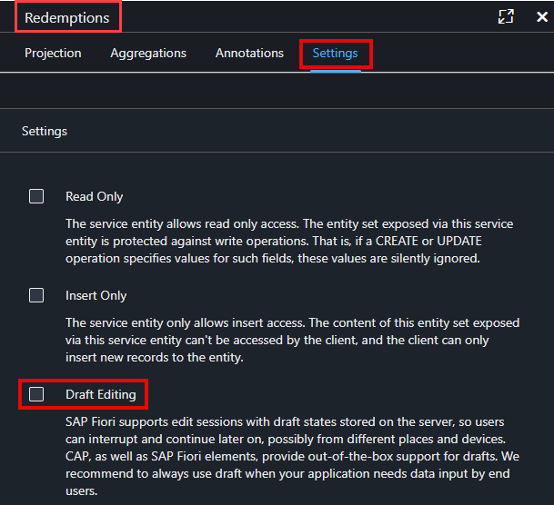
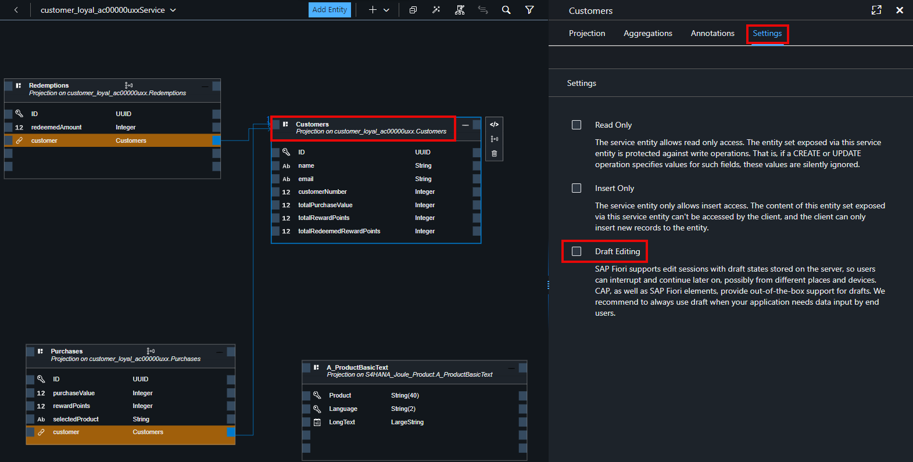
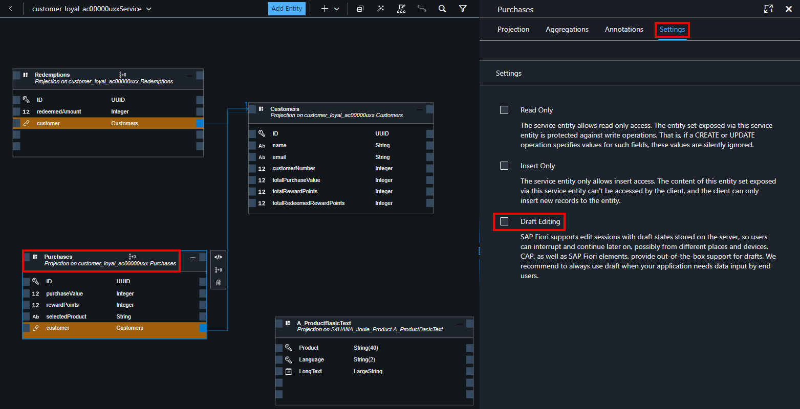

# Prepare & Deploy CAP Application

## Prerequisites

Your customer loyalty application has been using a test SQLite database during testing. To deploy the application, you will need to set up a SAP HANA Cloud database instance in your trial Cloud Foundry Environment. Refer to the steps here:  [Setup SAP HANA Cloud Trial](../hana-install/)

### Service

**Return to your Customer Loyalty project in SAP Build Code 
(you may need to refresh the browser).**

**If you want to create a customized UI with SAP Build Apps on top of
it, we need to adjust some settings in the service.**

**To do this, we will use the *Graphical Modeler* to disable the “Draft
Editing” mode for all three entity sets:**

- **Customers**

- **Purchases**

- **Redemptions**

1.  **Go to service.cds tab. Select the Redemptions entity and
    the Redemptions details will appear on the right hand side.**

2.  **Select Settings =\> Disable Draft Editing.**

    - **If you do not see *Settings* may have to move the *Show
      Details* content to the left**

3.  **Select Customers and disable *Draft Editing***

    - **You may have to move around to find Customers.**

4.  **Select Purchases and disable *Draft Editing***

## [Next Lesson ⎘](../ex2.1/)