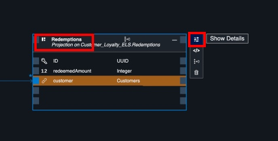

# Prepare & Deploy CAP Application

## Prepare the Service

**Return to your Customer Loyalty project in SAP Build Code 
(you may need to refresh the browser).**

**To create a customized UI with SAP Build Apps on top of
it your service, we need to adjust some settings.**

**To do this, we will use the *Graphical Modeler* to disable the “Draft
Editing” mode for all three entity sets:**

- **Customers**

- **Purchases**

- **Redemptions**

1.  **Go to service.cds tab (or open the services graphical modeler if it isn't already open).**

- **Select the Redemptions entity** 

- **If the redemption details panel isn't already open, select the Show Details tool button**

2.  **Select Settings =\> Disable Draft Editing.**

    - **If you do not see *Settings* tab you may have to resize the *Details* panel to the left**

3.  **Select Customers and disable *Draft Editing***

    - **You may have to move around to find Customers.**

4.  **Select Purchases and disable *Draft Editing***

## Prepare the Data

In a previous step, you generated sample data using Joule. This data is automatically loaded into the database when you are testing. However, sample data is not loaded into a deployed HANA database. For our workshop, we would like our sample data loaded into the database. To do this, we will move the data CSV files from the **test** directory to the **db** directory. Data stored in this directory is loaded as **Initial Data** (which is generally used for data that is part of your production model).

1. Open the **Explorer** in SAP Build Code

- Click the Explore icon on the tool bar

- Click to expand the test directory. 

- Note the 3 data files.

2. Drag and drop the data folder from the **test** folder to the **db** folder

- To do this, click on **data**, and drag it to **db**

3. Note the files are now located in the **db/data** folder. 

- You do not want the test folder in the db folder. The path should be **db/data**. If you have made a mistake, just adjust the files until you achieve this structure (ask your instructor if you need assistance).

## [Next Lesson ⎘](../ex2.1/)