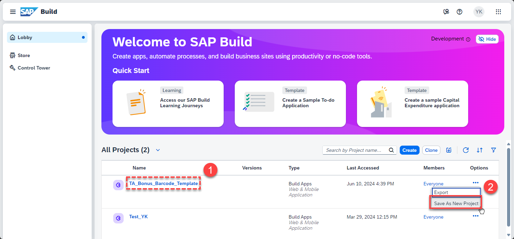
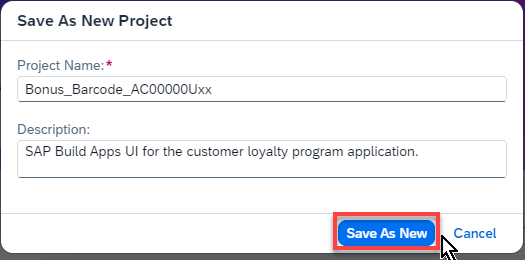

# SAP Build Apps

## Create Project from Template

To save time, you will upload the initial Build Apps project from a template, which you will extend.

1. Download the **Bonus Barcode.mtar** template

- Click [Bonus Barcode.mtar](files/Bonus%20Barcode.mtar)

- 

Note that there are 2 different approaches to creating the UI.

You can use the first approach, Create Project from Template, which will
bypass the nitty gritty work of adding and stylizing components, and
instead teach you how to use a pre-built existing SAP Build Apps project
as template to create your project. This is a is much faster way, which
we suggest to save time.

However, you can also use the second approach instead, Basic steps.
There you can learn everything about UI components, stylizing them, and
organizing them on the page.

In the interest of time, by default we will follow the Create Project
from Template approach. However, the Basic steps approach is also
available as an optional exercise at the end of the SAP Build Apps unit.

1.  Locate (do NOT click) the TA_Bonus_Barcode_Template from the list of
    projects.

2.  Use the three dots on the right side and select Save As New Project.

3.  Provide

    - Name: Bonus_Barcode_AC117059U01

    - Description: SAP Build Apps UI for the customer loyalty program
      application

and finally select Save as New.

4.  You have successfully created the UI project from the prepared
    template.

## [Next lesson](../ex3.2/)
