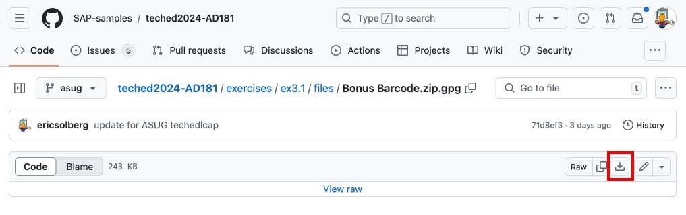
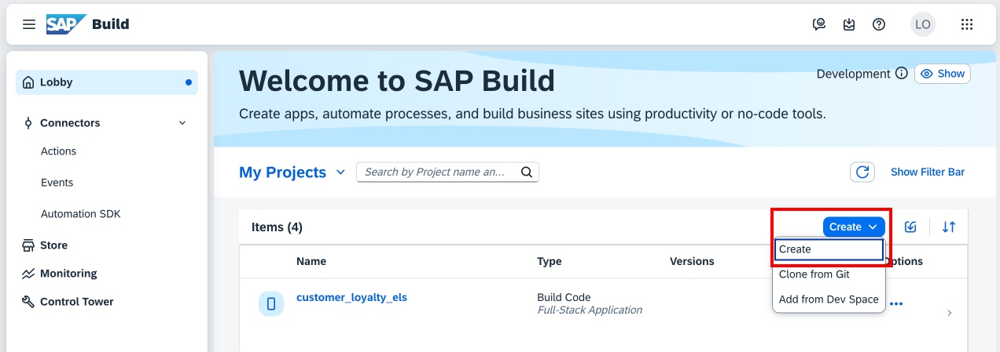
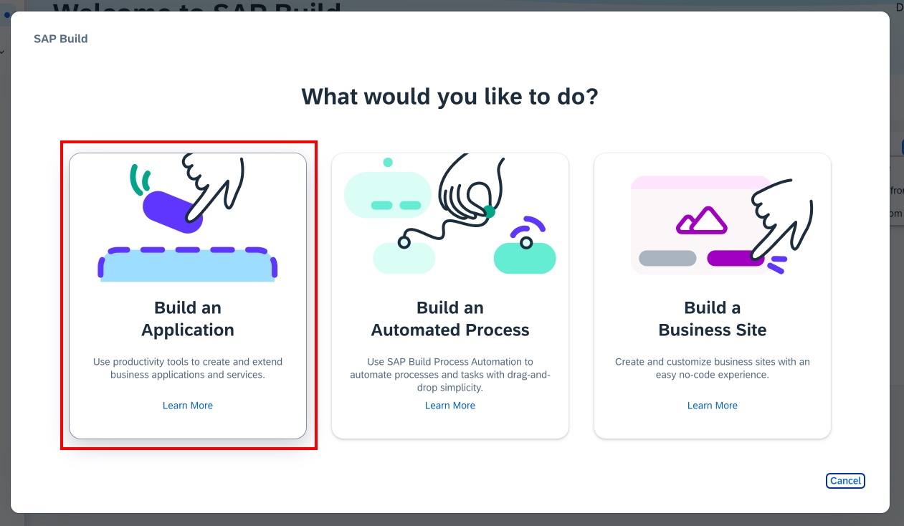
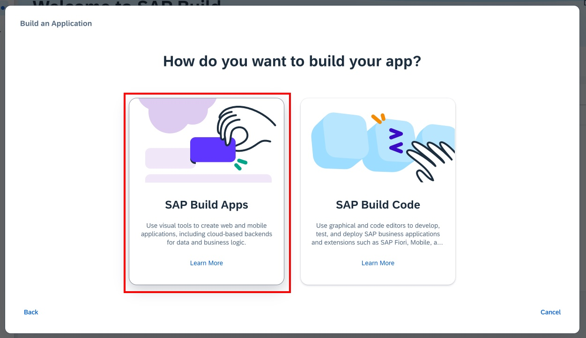
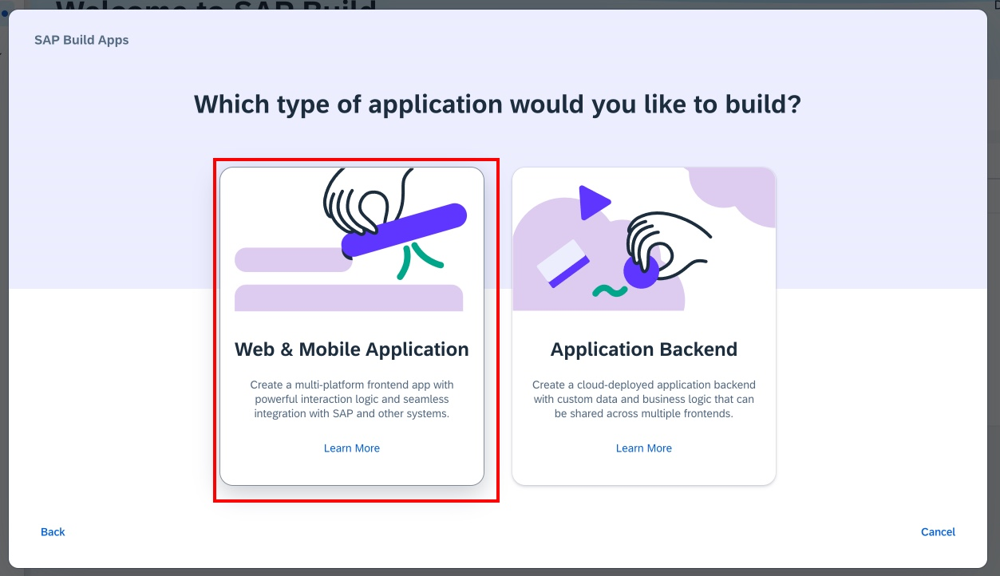
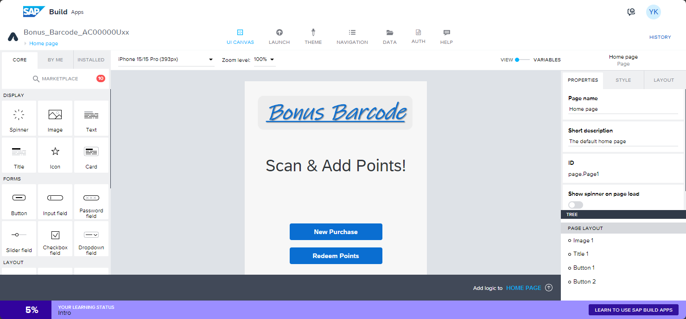

# SAP Build Apps

## Create Project from Template

To save time, you will upload the initial Build Apps project from a template, which you will extend.

1. Download the **Bonus Barcode.mtar** template. This is a compressed SAP Build Apps export file.

- Click [Bonus Barcode.mtar](files/Bonus%20Barcode.mtar)

- Click on the **Raw Download** button and save to your computer

2. Import the project from the SAP Build Lobby. 

- If youu don't have the Lobby open in a tab, you can refer to these instructions to access it: [Accessing your BTP trial account, subaccount, and the SAP Build Lobby](../lobbyaccess/).

- Click on the Import button in the Lobby

3. On the Import dialog, click **Browse Files** and select the downloaded **Bonus Barcode.mtar** file (you can also drag and drop the file here).

4. Once uploaded, select the **Bonus Barcode** entry, then click **Import**. Close the import dialog.

5. The Bonus Barcode project is imported into the Lobby. 

## Launch SAP Build Apps

1. Click the Bonus Barcode project title to open SAP Build Apps.

## [Next Lesson ⎘](../ex3.2/)
