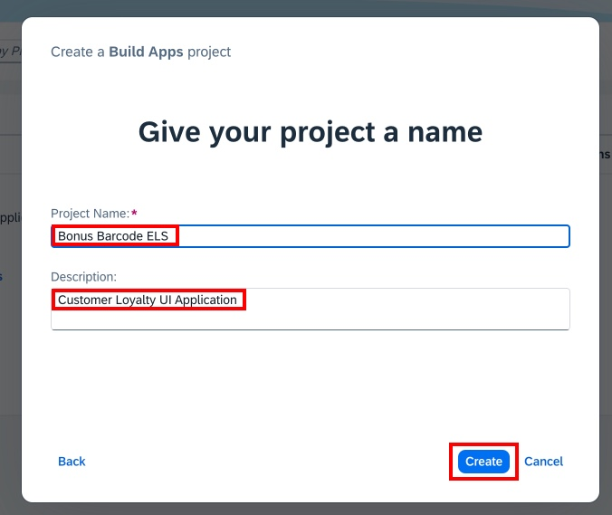
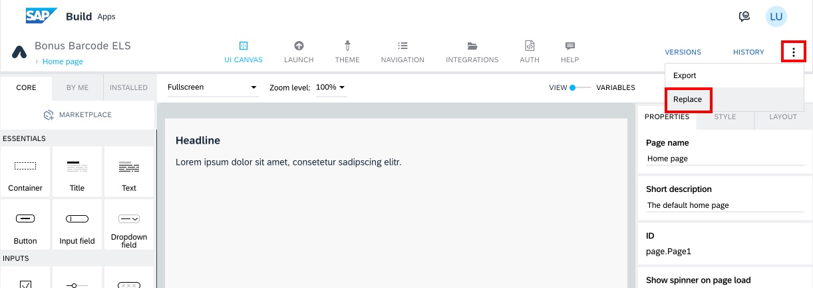
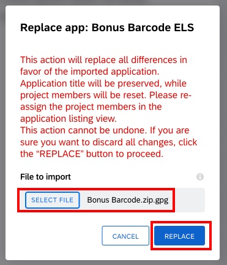
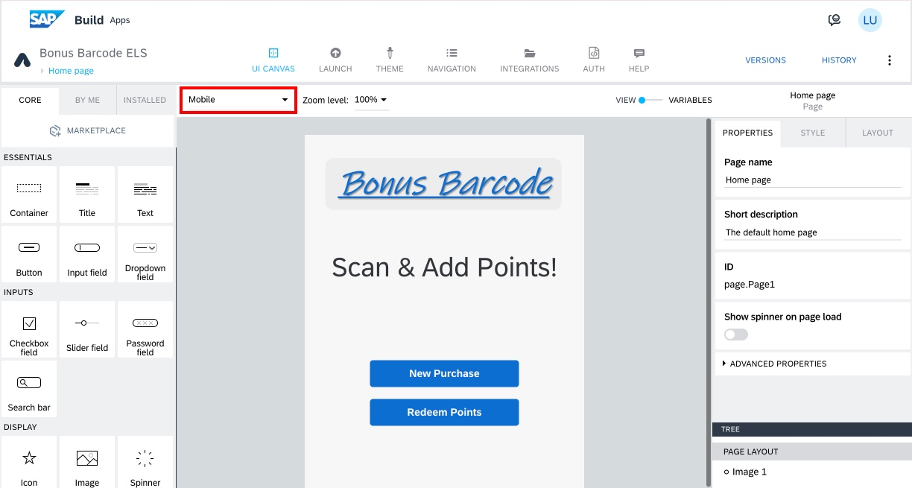

# SAP Build Apps

## Create Project from Template

To save time, you will upload the initial Build Apps project from a template, which you will extend.

1. Download the application template to your computer:

- Open this link in a new tab: [Bonus Barcode.zip.gpg](files/Bonus%20Barcode.zip.gpg)

- Click on the **Raw Download** button and save to your computer

2. Return to the [SAP Build Lobby](https://lcapteched.eu10.build.cloud.sap/lobby). In the lobby, select the **Create** dropdown, the select **Create**.

3. Select **Build an Application**

4. Select **SAP Build Apps**

5. Select **Web & Mobile Application**

6. Enter the project information:

- Project Name: **Bonus Barcode XXX** (XXX are your initials)

- Description: **Customer Loyalty UI Application**

- Click **Create**

7. SAP Build Apps will open, with a new application. You will replace this with the template application you downloaded:

- Click the extra menu (3 vertical drops, upper right corner of the screen).

- Click Replace

8. In the Replace App dialog:

- Click **Select File** and select the **Bonus Barcode.zip.gpg** file you downloaded in Step 1.

- Click **Replace**

9. The application template is now loaded. You may wish to select the Mobile form factor, if not already selected (optional).

## [Next Lesson ⎘](../ex3.2/)
