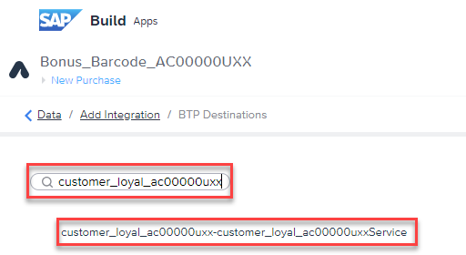

# SAP Build Apps

## Authentication and Data Integration

1.  Select the page name written in blue at the top left corner of your
    page. Go to the page: New Purchase

2.  Go to the AUTH tab \> Enable Authentication

3.  Select SAP BTP authentication \> OK

4.  Go to the DATA tab \> Add Integration

5.  Select BTP Destinations

6.  Search for your SAP Build Code project
    name: customer_loyal_ac117059u01

- Select your project once it is listed

7.  Select Install Integration

8.  Select Enable Data Entity for all four (4) Data entities listed on
    the left:

    - Customers

    - Purchases

    - Redemptions

    - A_ProductBasicText

9.  Select Save

## [Next lesson](../ex3.3/)
