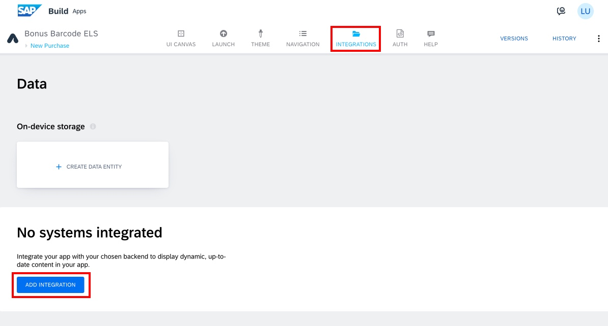
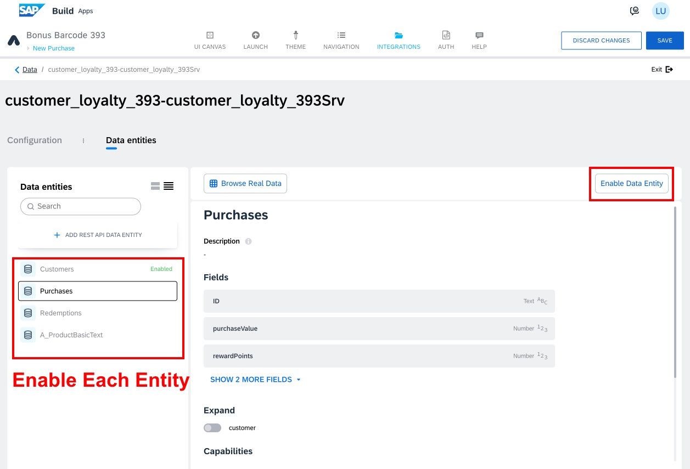

# SAP Build Apps

## Authentication and Data Integration

1.  Select the page name written in blue at the top left corner of your
    page. Go to the page: New Purchase

2.  Go to the AUTH tab \> Enable Authentication

3.  Select SAP BTP authentication \> OK

4.  Go to Integrations \> Add Integration

5.  Select BTP Destinations

6.  Select your Build Code project named **customer_loyalty_xxx-customer_loyalty_xxxSrv**. You can search for your user number to filter out other projects.

7.  Select Install Integration

8.  Select Enable Data Entity for all four (4) Data entities listed on
    the left by selecting each entity and clicking **Enable Data Entity**.

    - Customers

    - Purchases

    - Redemptions

    - A_ProductBasicText

9.  Select Save

## [Next Lesson ⎘](../ex3.3/)
