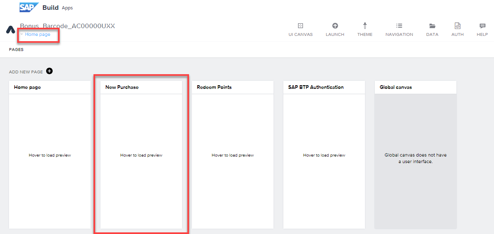
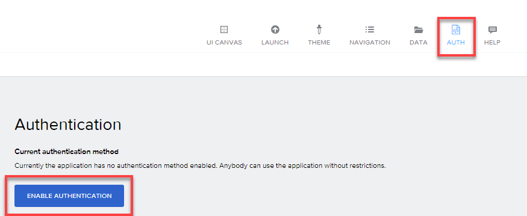
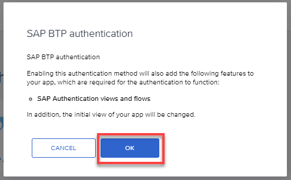
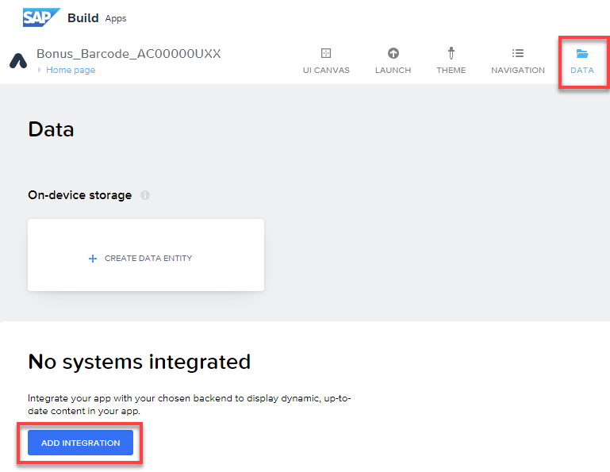
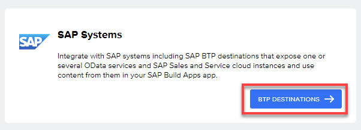
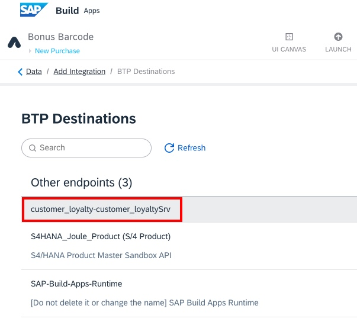
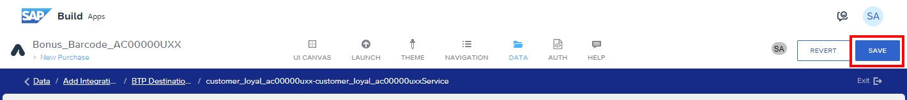
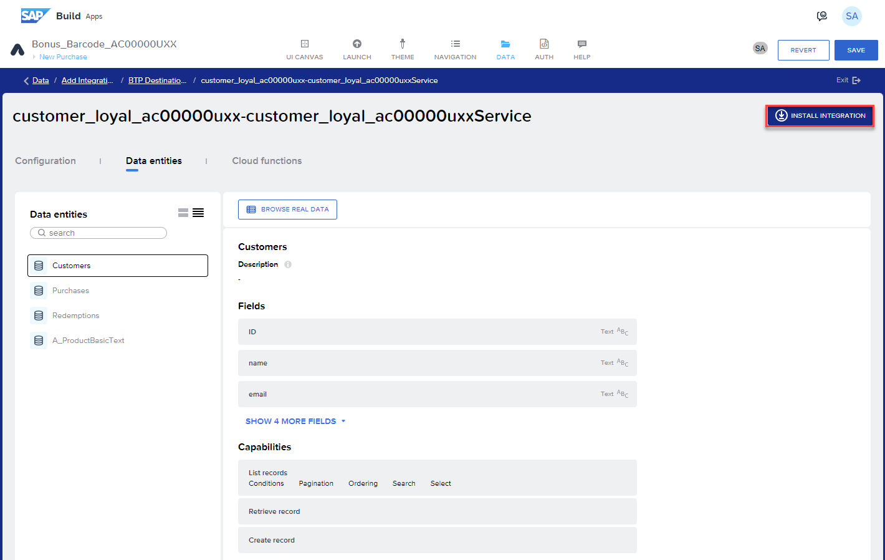
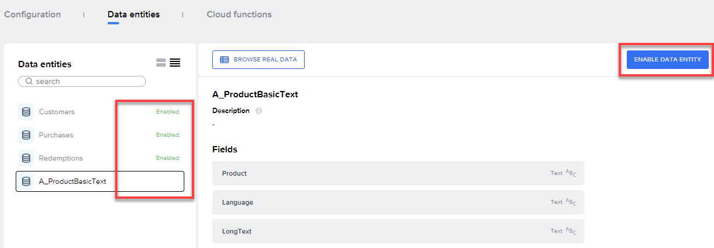

# SAP Build Apps

## Authentication and Data Integration

1.  Select the page name written in blue at the top left corner of your
    page. Go to the page: New Purchase

2.  Go to the AUTH tab \> Enable Authentication

3.  Select SAP BTP authentication \> OK

4.  Go to the DATA tab \> Add Integration

5.  Select BTP Destinations

6.  Select your Build Code project named **customer_loyalty-customer_loyaltySrv**

7. In case you receive an error message "Request failed with status code 404", your Build Code app may be stopped. If you do not have this error, skip this step.

- In the subaccou t, go to **Cloud Foundry > Spaces** and click the **dev** space

- Select **Applications**

- If **customer-loyaltySrv** is stopped, click the **Start** button on the right.

- Repeat Step 6 above

8.  In SAP Build Apps, Select Install Integration

9.  Select Enable Data Entity for all four (4) Data entities listed on
    the left:

    - Customers

    - Purchases

    - Redemptions

    - A_ProductBasicText

10.  Select Save

## [Next Lesson ⎘](../ex3.3/)
