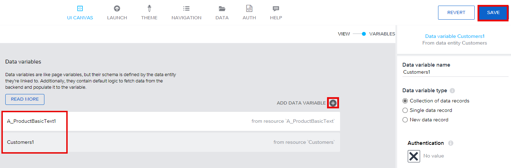
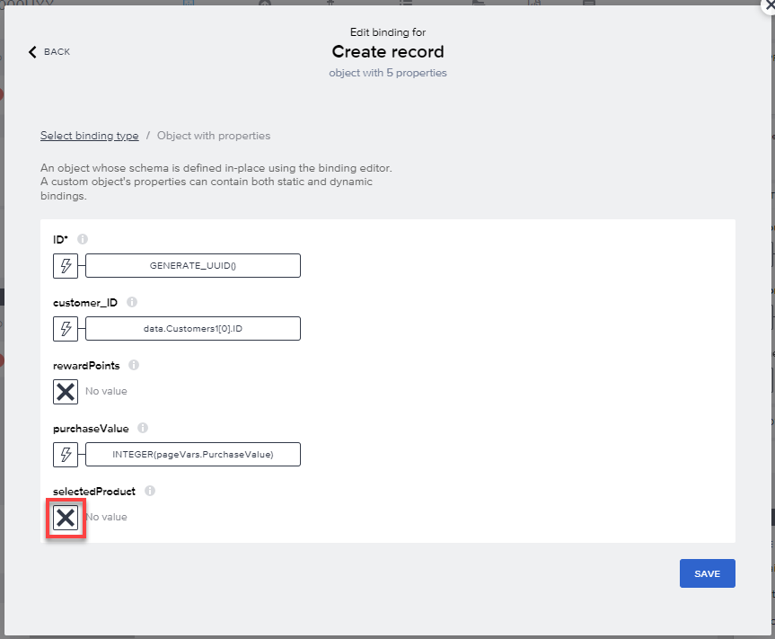

# SAP Build Apps

## New Purchase Page - Logic for Data Variables

1.  Go to UI Canvas \> Variables \> Data Variables

2.  Add 2 data variables: A_ProductBasicText and Customers

- Select SAVE

Note: Please make sure that you have same data variable names in your
screen: A_ProductBasicText1 and Customers1

3.  Select Customers1 data entity. Select the \[X\] icon under Filter
    condition.

4.  Select Object with Properties

5.  Add a condition:

    - Property: *customerNumber*.

    - Condition type: *equal*.

    - Select the ‘123’ icon under Compared value

6.  Go to Formula \> Select into the Formula field

7.  Enter the formula below and Save the formula afterwards

INTEGER(params.SelectedCustomerNumber)

8.  Save the condition

9.  Switch to VIEW.

10. Drag & Drop the UI Components with the following order:

    - Dropdown field

    - Input field

    - Button

11. Switch to VARIABLES \> PAGE VARIABLES \>

12. Create 2 Page Variables

    - Variable 1: Name: PurchaseValue Variable Value type: number

    - Variable 2: Name SelectedProduct Value type: text

13. Select Save

14. Switch back to VIEW then:

    - Select Dropdown field.

    - Rename the Label text: Select Product.

    - Select the ‘\[ \]’ icon under Option list.

15. Go to Formula

16. Enter the formula below

MAP(data.A_ProductBasicText1, {label:item.Product, value:item.Product})

17. Save the Formula

16. Select the X under Selected value

17. Go to Data and Variables \> Page variable \> SelectedProduct \>
    select Save

18. Select Input field and Rename label: Purchase Value

19. Select the ‘X’ icon under Value

20. Go to Data and Variables \> Page variable \> PurchaseValue

21. Select Save

22. Select Button \> Rename label: Add Points!

23. Open Logic Canvas

23. Drag & Drop the logic components below to create the logic
    and join each component.

    - Create record

    - Alert

    - Navigate back

24. Select Save

25. Select Create record function \> Select the data
    entity Purchases and Save.

26. Select the Custom Object

27. Select the ABC icon under ID \> Formula

28. Select the Formula bar.

28. Enter the following formula and Save:

GENERATE_UUID()

28. Select the \[X\] icon under customer_ID \> Formula \> Create formula

29. Enter the following formula and Save:

data.Customers1\[0\].ID

30. Select the \[X\] icon under purchaseValue \> Formula \> Create
    formula

31. Enter the following formula and Save:

INTEGER(pageVars.PurchaseValue)

32. Select the \[X\] icon under selectedProduct \> Data and Variables \>
    Page Variable \> SelectedProduct

33. Save the window

34. Select *Alert* component \> Select the *ABC* icon under Dialog title
    \> Formula

35. *Copy* and *Paste* (as plain text) the formula below \> Save

data.Customers1\[0\].name + " has successfully earned " +
outputs\["Create record"\].response.rewardPoints + " points!"

36. Save the project

## [Next Lesson ⎘](../ex3.4/)
