# SAP Build Apps

## Redeem Points Page - Logic for Data Variables

1.  Select New Purchase and Redeem Points

2.  Drag & Drop the UI Components in the following order:

    - Input field

    - Button

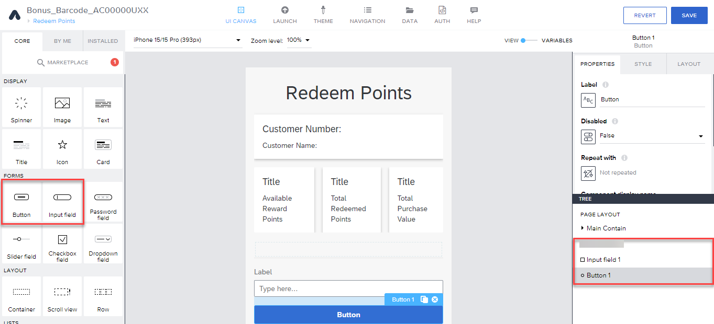

3.  Switch to Variables \> Page Variables \> Add a Page Variable

4.  Rename as follows:

- Variable Name: RedemptionAmount

- Variable Value type: Number

5.  Save

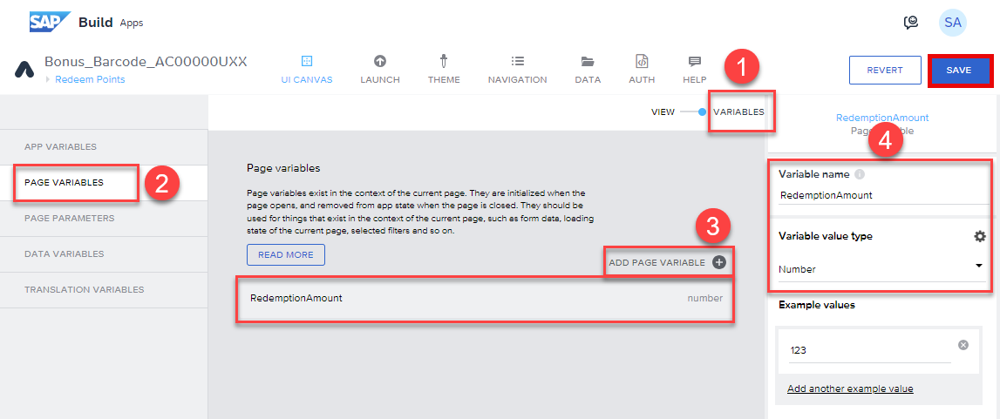

6.  Select Data Variables \> ADD DATA VARIABLE \> Customers1

7.  Select X under Filter Condition

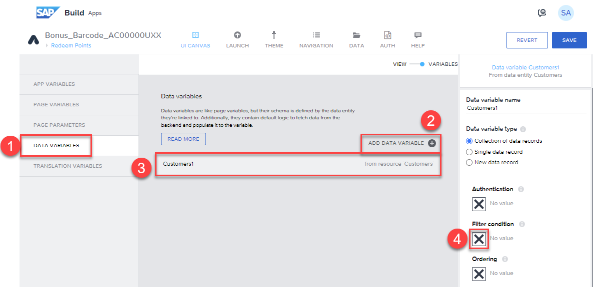

8.  Select Object with Properties

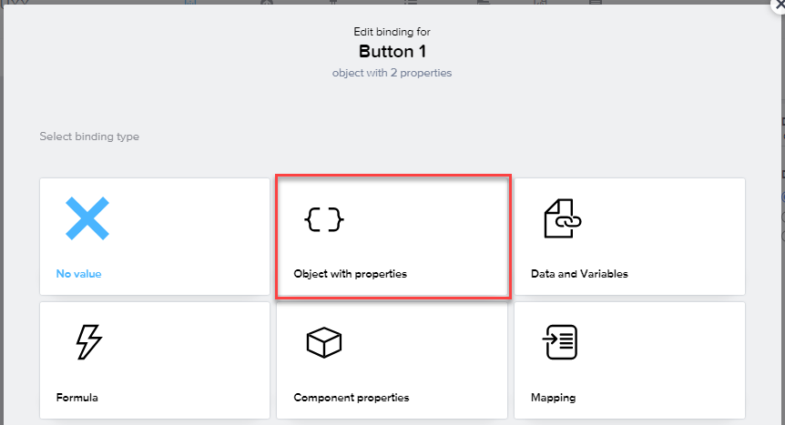

9.  Select Add Condition and select the following:

- Property: customerNumber

- Condition type: equal

10.  Select ‘123’ icon under Compared value

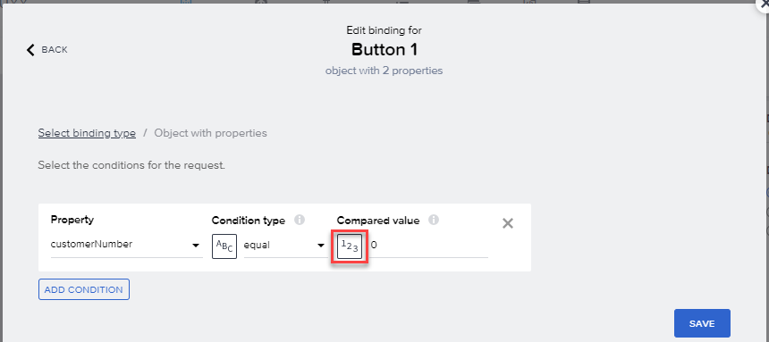

11.  Select Formula \> Select the Formula Bar and Enter the following
    formula:

INTEGER(params.SelectedCustomerNumber)

12.  Hit Save twice.

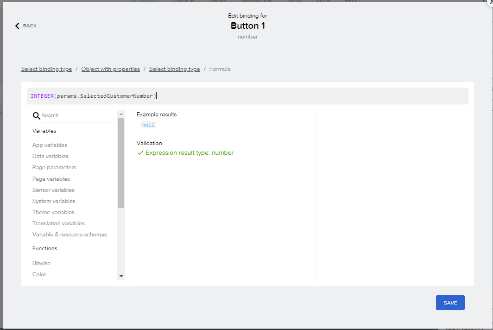

13.  Change to View and Select Input field

14. Rename label: Redemption Amount

15. Select \[X\] icon under Value

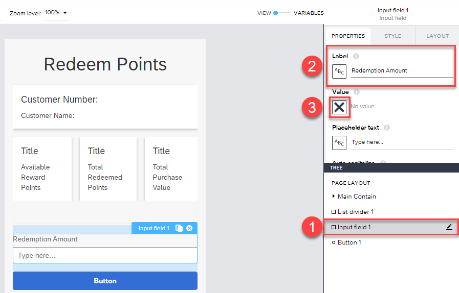

16. Choose Data and Variables \> Page Variable \> Redemption
    Amount and Save

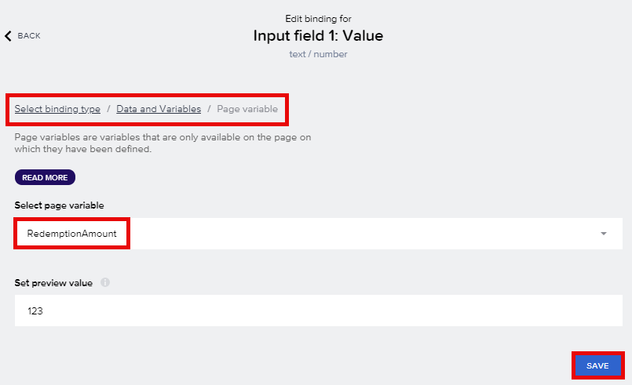

17. Select Button \> Rename label: Redeem Points!

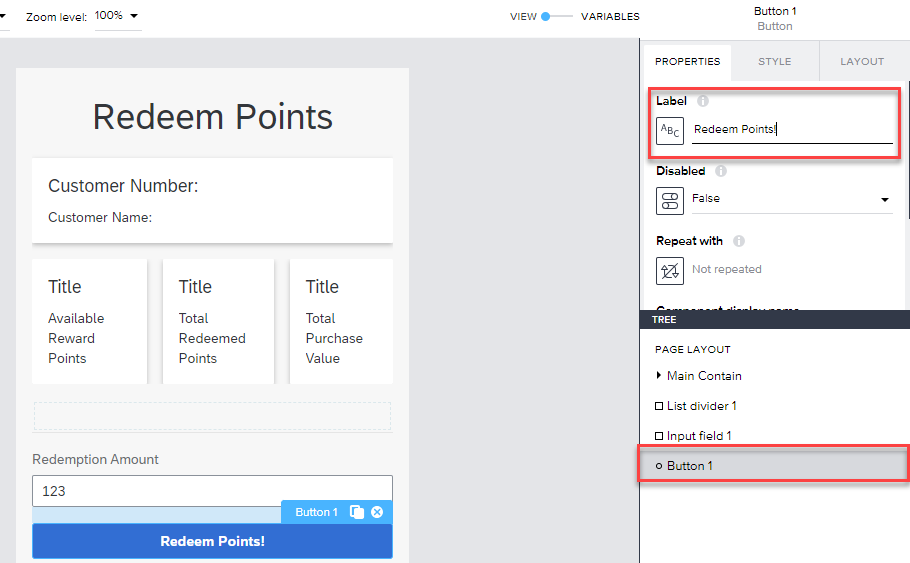

18. Make sure the Redeem Points button is selected, and drag & drop the logic components to create the logic flow shown
    below.

    - Create record

    - Alert

    - Navigate back

19. Join the components and Save

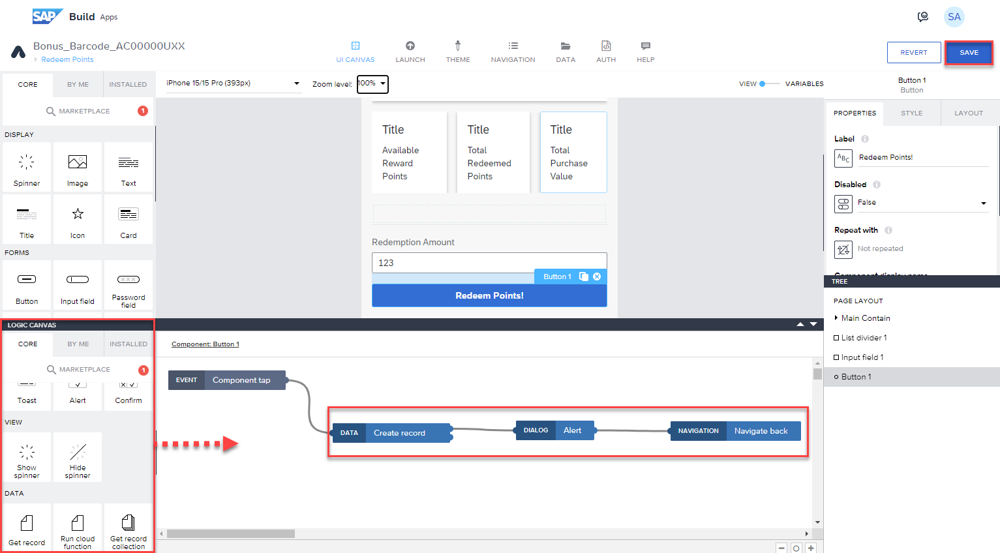

20. Select the Create record function

21. Select data entity: Redemptions from the drop down. Save your work

22. Select the Custom Object

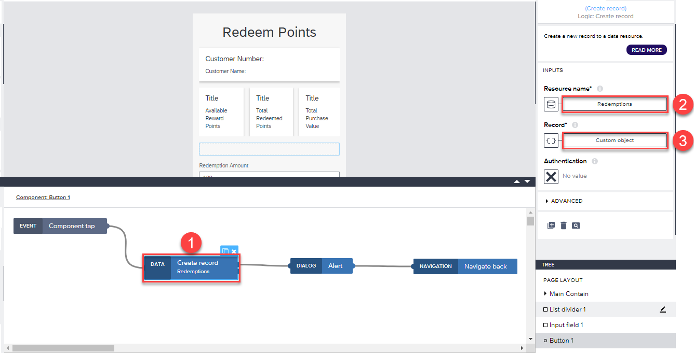

23. Select the ABC icon under ID

- Select Formula

- Select the Formula bar

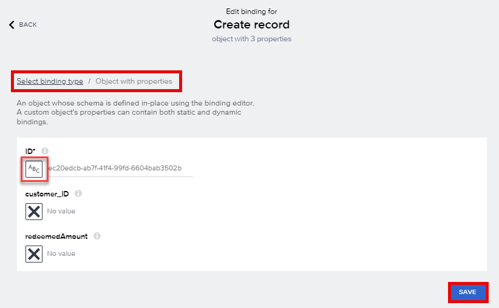

24. Enter the following formula and Save:

GENERATE_UUID()

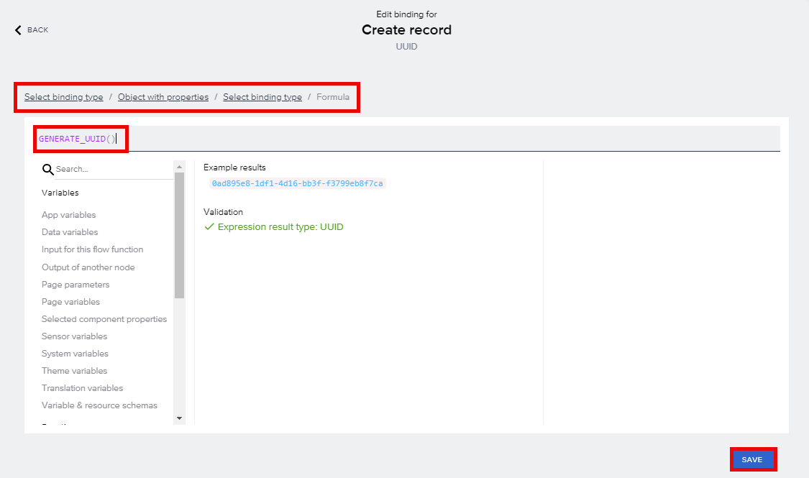

25. Select the \[X\] icon under customer_ID \> Formula \> Create formula

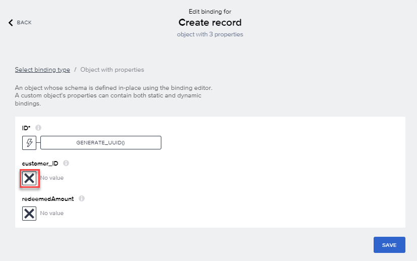

26. Enter the following formula and Save:

data.Customers1\[0\].ID

27. Select the \[X\] icon under redeemedAmount \> Formula \> Create
    formula

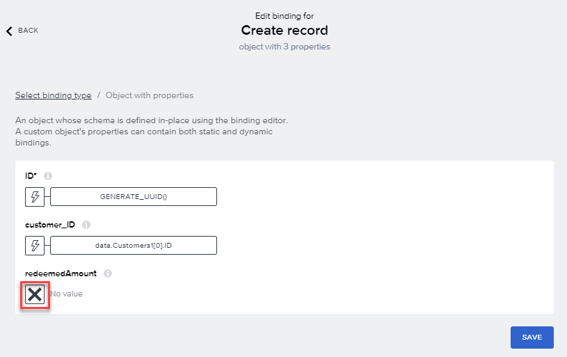

28. Enter the following formula and Save:

INTEGER(pageVars.RedemptionAmount)

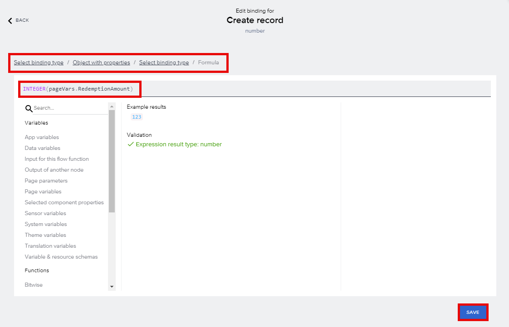

29. Save the window

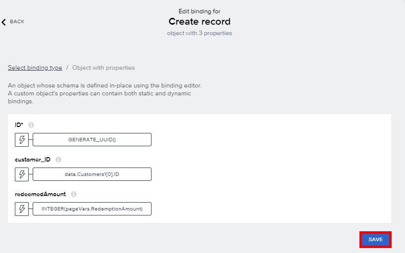

30. Select Alert component \> Select the ABC icon under Dialog title \>
    Select Formula

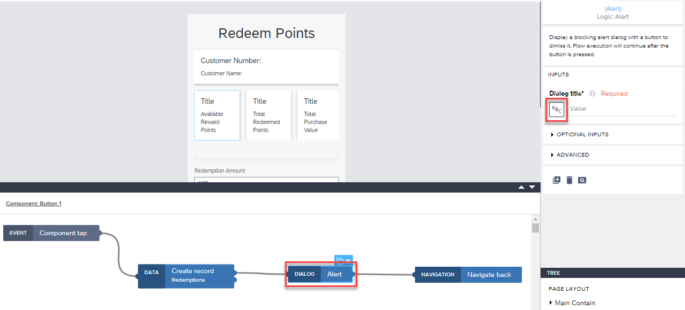

31. Copy and Paste (as plain text) the formula below and Save

data.Customers1\[0\].name + " has redeemed " +
pageVars.RedemptionAmount + " successfully"

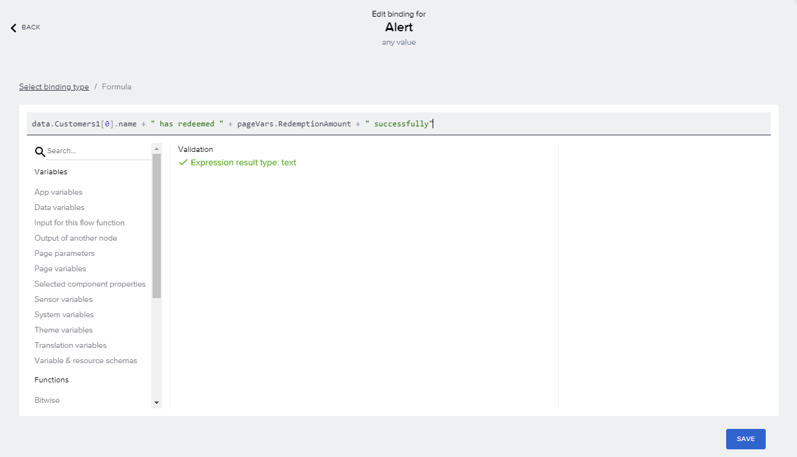

32. Make sure to save your work - Top right!

## [Next Lesson ⎘](../ex3.5/)
