# SAP Build Apps

## Preview and Test

1.  Go to Launch \> Open preview portal

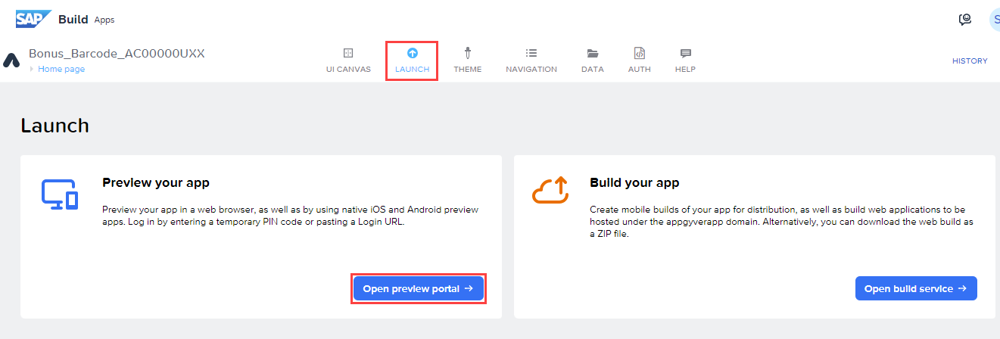

2.  Download SAP Build Apps Preview from your mobile store

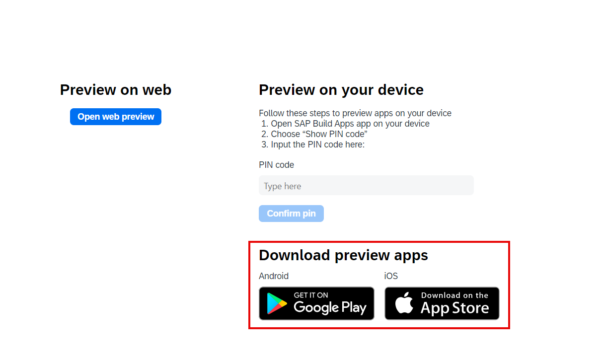

3.  Install the SAP Build Apps Preview application on your mobile
    device.

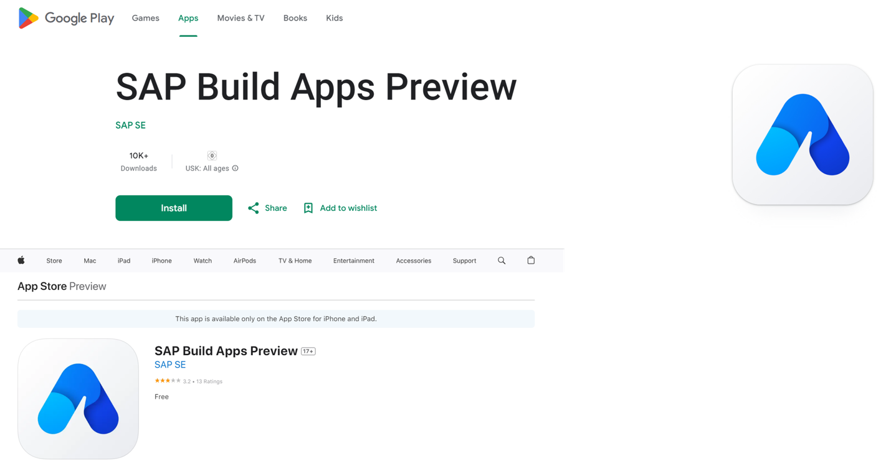

4.  Launch SAP Build Apps Preview in your mobile device then
    select Other Login options.

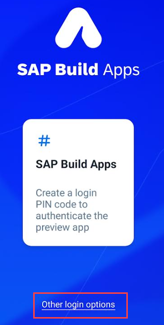

5.  Select the edition **SAP Build Apps US10** and select **Generate code**.

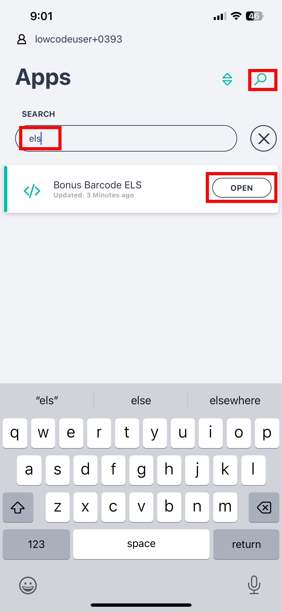

Note down the PIN Code (yours will be different).

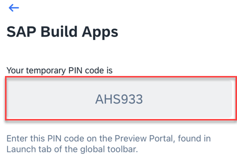

6.  Use the PIN Code here and Confirm pin.

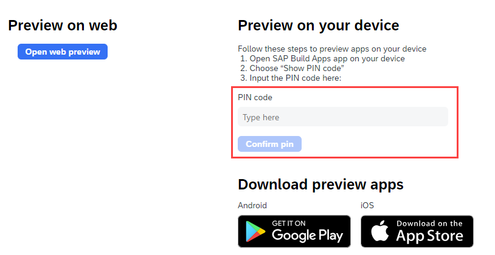

7.  Mobile Previewer will show you the list of projects in your lobby

8.  Launch the **Bonus Barcode** app and select **New Purchase**

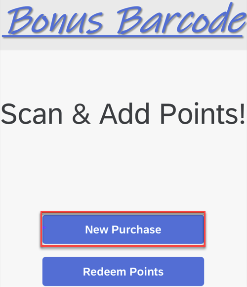

9.  Scan the Customer Loyalty Card here using Barcode Scanner.

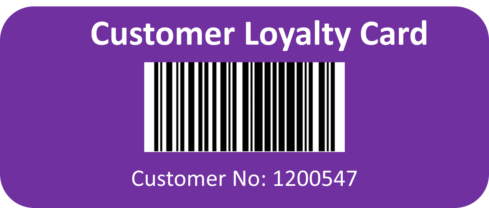

If you are using an Android device then you may need to update the App
permissions

SAP Build Apps - Permissions - Camera - Photos and Videos permission -
Allow

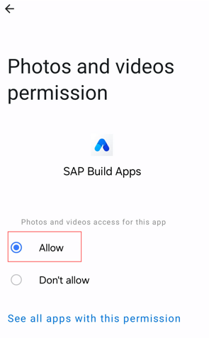

Alternatively, enter the customer number (1200547) manually!

10. Select a Product from dropdown list

11. Add some value for the Purchase Value

12. Select Add Points!

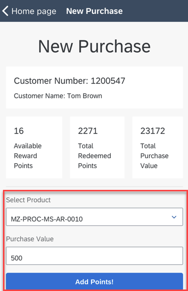

13. See the Response from the backend service

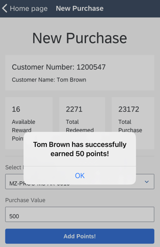

14. Go to Redeem Points

Redeem some points from the same customer and experience the flow

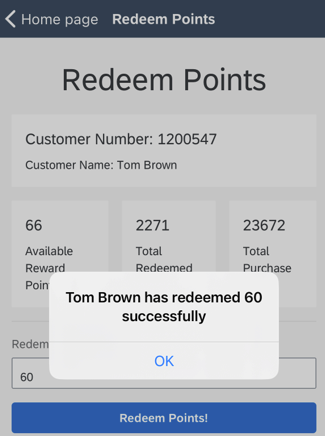

15. Go to SAP Build Apps Design Time \> DATA tab \> Customers

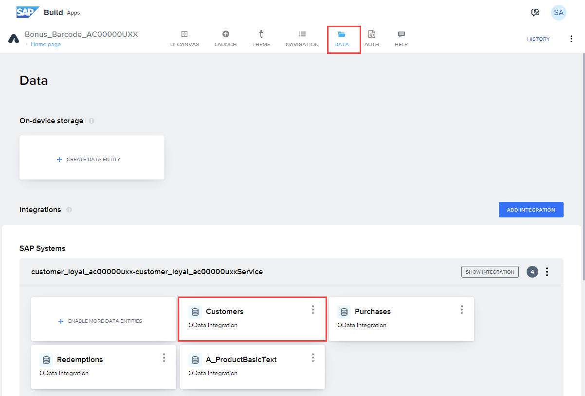

16. Browse Real Data

- See your updates for the Customers data entity.

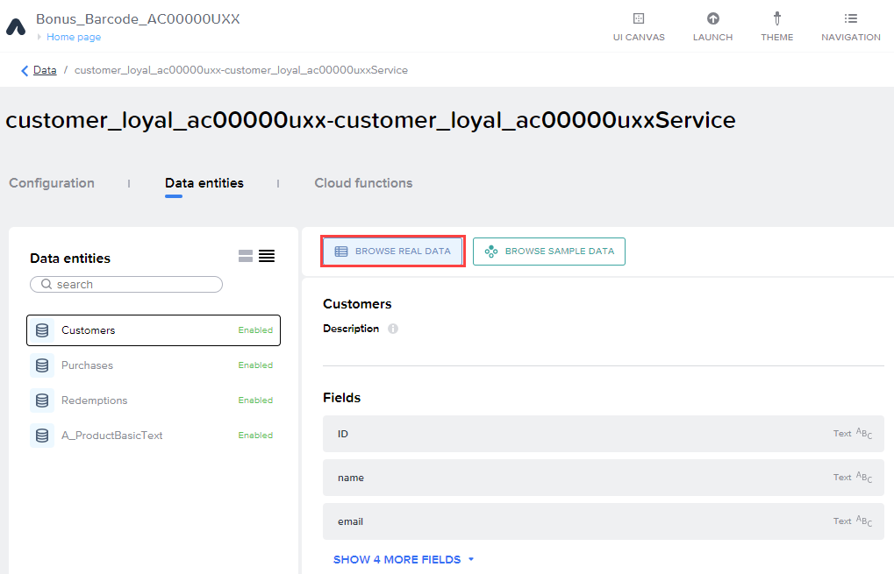

Congratulations! You have finished this unit.

## [Next Lesson ⎘](../ex4/)