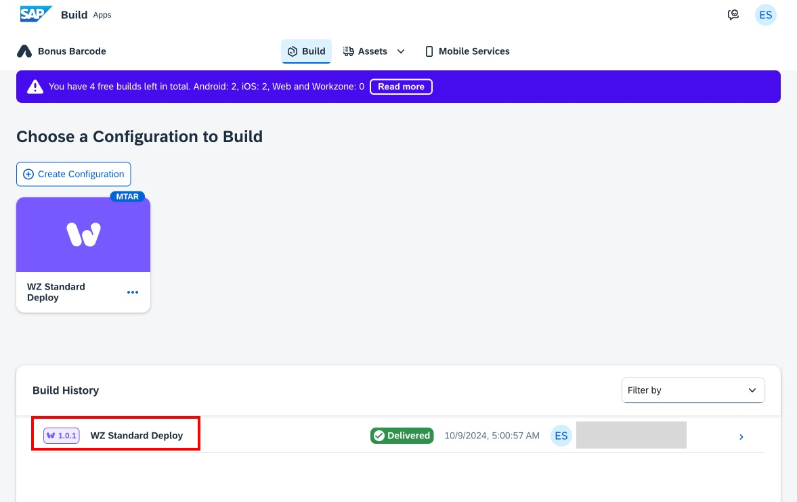
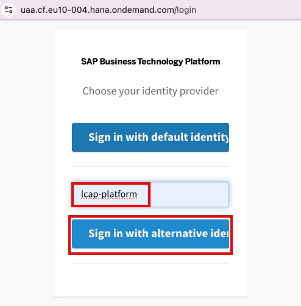
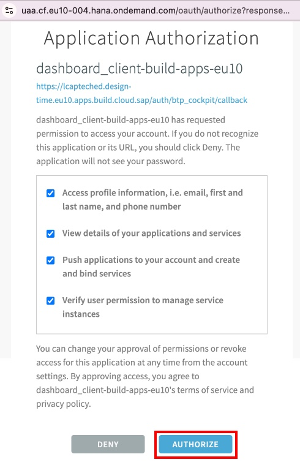

# Deploy SAP Build Apps to Work Zone

## Build your app for deployment

1.  You should already have your app open in SAP Build Apps from the previous exercise. If not, you can return to the Lobby to open the Bonus Barcode app. If you need assistance with this, refer to [Accessing your BTP trial account, subaccount, and the SAP Build Lobby](../lobbyaccess/)

2. Select the Launch tab

2. This opens the **Launch** tab, that you previously used to preview your app. This time, select **Open Build Service** under **Build Your App**.

3. SAP Build Apps can build for mobile device deployment, or for Work Zone deployment. For this we will create a new build configuration. Select **Create Configuration**.

4. The target platform will be **SAP Build Work Zone**.

5. Give your build configuration a name such as **WZ Standard Deploy** and click **Create**.

6. You can now build your app by selecting **Build** from the drop-down menu on your build configuration.

7. Enter your build options:

- Enter **1.0.0** for your build version

- Select **Latest** for the Runtime Version

- Click **Build**

The new build will show up in your Build History with an indicator of the build progress.

## Deploy your app to SAP Build Work Zone, standard edition

1. Once the build is complete, the status will change to **Delivered**. Click on the build name to access the build details.

2. On the build details screen, click **Deploy**.

3. This will open the Deploy to Work Zone dialog.

- Select the **cf-eu10-004** API endpoint.

- After selecting the endpoint, you will need to select **Login with BTP**. This will launch a separate window to authenticate using your BTP credentials.

4. Log into BTP

- Enter **lcap-platform** in the origin key field

- Select **Sign in with alternative identity provider**

5. Authorize the Build Apps dashboard client

4. After logging in:

- Use the **Organization** dropdown to select **TechEdLCAP_lcapteched** 

- Use the **Space** dropdown to select the **dev** space.

- Click **Continue**

5. The Deploy to Work Zone dialog will show you the build progress. Once it finishes, it will indicate that your app is live at the specified endpoint URL.  You can close this dialog.

## [Next Lesson ⎘](../ex4.2/)
