# Configure a business site and access your app

## Assign role collections for SAP Build Work Zone, standard edition

To access Work Zone, you'll need to give your users the **Launchpad Admin** role collection.

1. Navigate back to the trial subaccount cockpit. If you don't have this already open in a browser tab, you can refer to these steps: [Accessing your BTP trial account, subaccount, and the SAP Build Lobby](../lobbyaccess/). If you have had the tap open, you will likely need to refresh your browser and log in again.

2. Add the role collection to the custom identity

- Select **Security > Users**

- Select your user name (with the custom identity provider)

- Select **Assign Role Collection** from the drop down menu under the **Role Collections** section of your user details

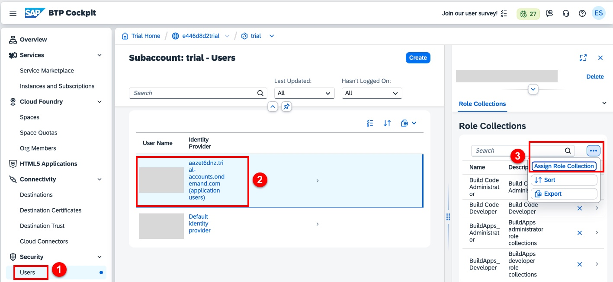

3. Assign the role collection

- Search for **Launch** in the search field

- Select the **Launchpad Admin** role

- Click **Assign Role Collection**

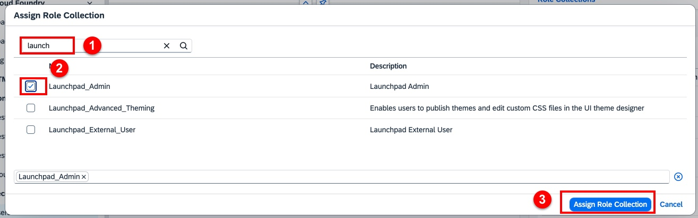

3. Repeat steps 1 and 2 for your user with the default identity provider

## Access Work Zone from the SAP Build Lobby

1. Return to the SAP Build Lobby. If you don't already have this open in another browser tab, you may refer to these steps: [Accessing your BTP trial account, subaccount, and the SAP Build Lobby](../lobbyaccess/)

2. From the Lobby, select **Create** from the drop-down menu.

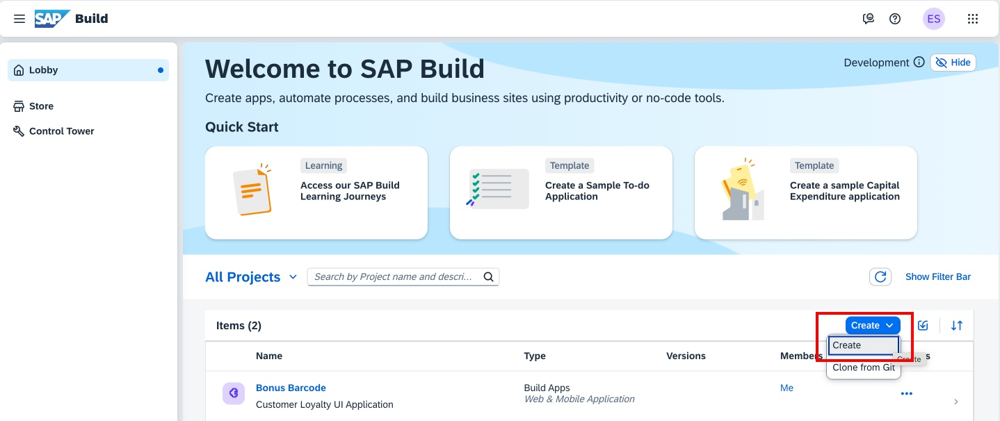

3. Select **Build a Business Site**

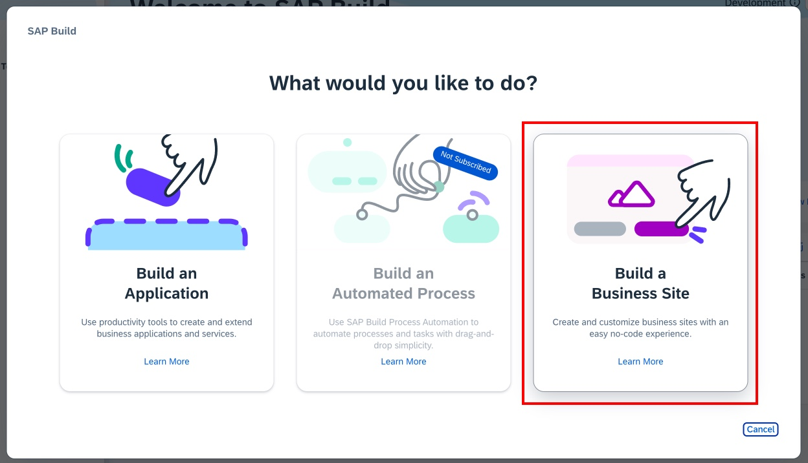

4. Select **Configure Site in Admin Console**. Note that the Manage Workpages and Workspaces option in unavailable. This option is available when you have SAP Build Work Zone, advanced edition enabled.

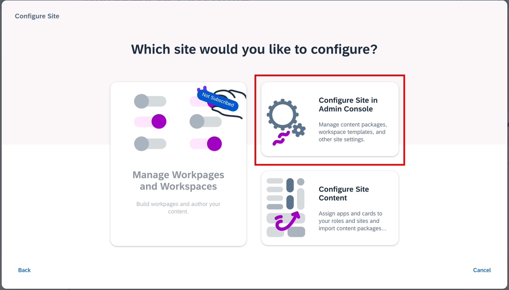

## Configure Work Zone for the custom identity provider

1. You may recall that after deploying the customer loyalty app to Work Zone, the app link would result in Access Denied. We will configure Work Zone to use the custom identity provider to resolve this.

- Select the Site Settings icon

- Select the **Identity Authentication** tab

- Click the checkbox to confirm that the identity provider trust configuration has been established. This was done automatically for you, so you can check this checkbox.

- Click Enable.

- Log out of Work Zone (profile icon on the upper right) and log back in.

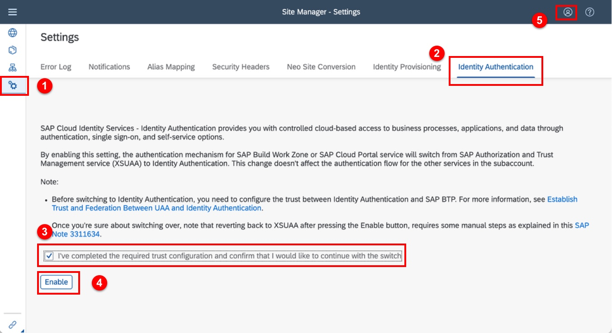

## Create a new business site for your app

1. We'll create a new business site for this app and any other customer apps that are built in the future.

- Select the Site Directory icon

- Click **Create Site**

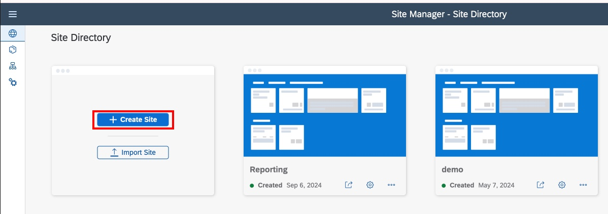

2. Enter a name for your site. Here we've called in **Customer Zone**

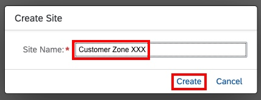

3. The new site settings will be displayed. We do not need to change these. Just click the back arrow on the top left corner of the page.

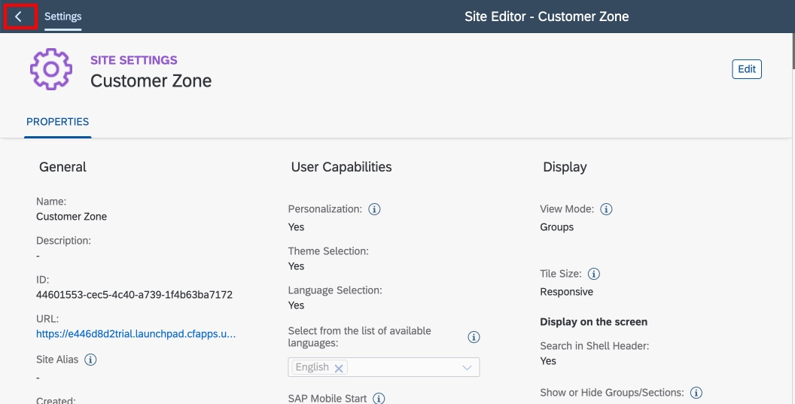

## Make your app available in Work Zone

There are a few steps to register your new app, to make it available Work Zone.

1. Refresh the HTML5 application channel connector:

- Select the Channel Manager icon

- Click the Refresh icon

- Wait a few moments for the status to change to **Updated**

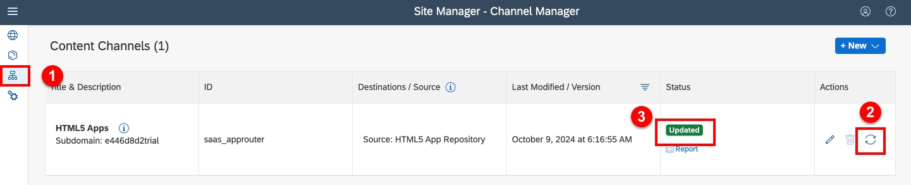

2. Access the Content Explorer

- Select the Content Manager icon

- Click **Content Explorer**

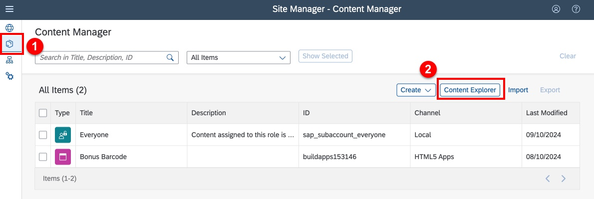

3. Click on the **HTML5 Apps** tile to browse the available HTML5 apps.

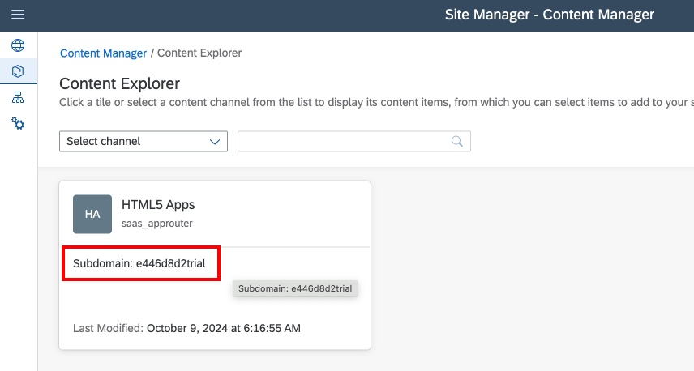

4. All of the apps you have developed in this exercise are included here. Let's enable all of them.

- Select each app -- **Customers**, **Redeptions**, **Purchases**, and **Bonus Barcode**

- Click **Add**

- Click the Content Manager cookie crumb to return to go back

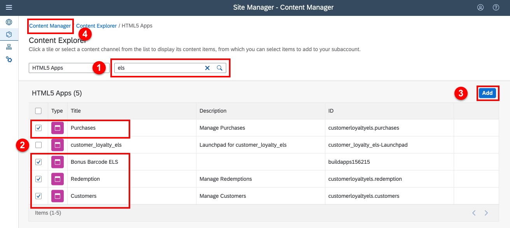

5. Now we can include these in an application group (if you'd like you can create a separate group for the Bonus Barcode app).

- Select the Content Manager icon

- Click **Create** and select **Group**

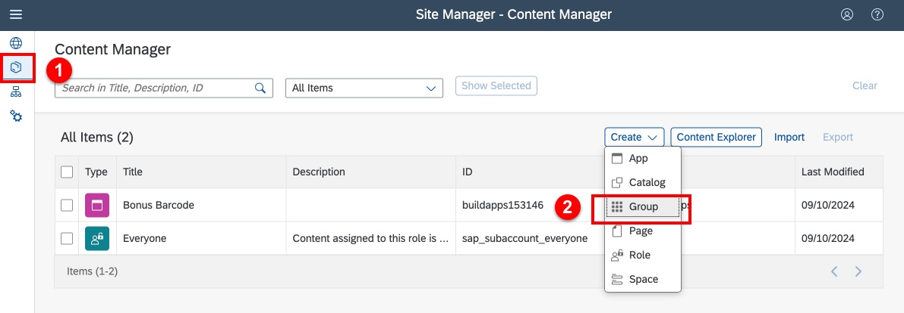

6. Configure the group:

- Give the group a name, such as **Customer Zone**

- Click the toggle to enable each of your apps

- Click **Save**

- Click on the Content Manager cookie crumb to return

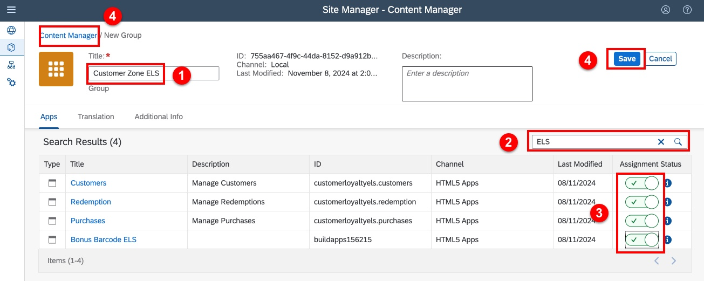

7. Make the apps available to all users (the Everyone group)

- Click the Content Manager icon

- Select the **Everyone** group object

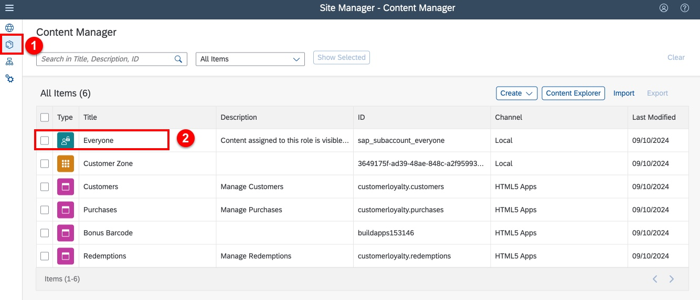

- Click **Edit** to edit the group

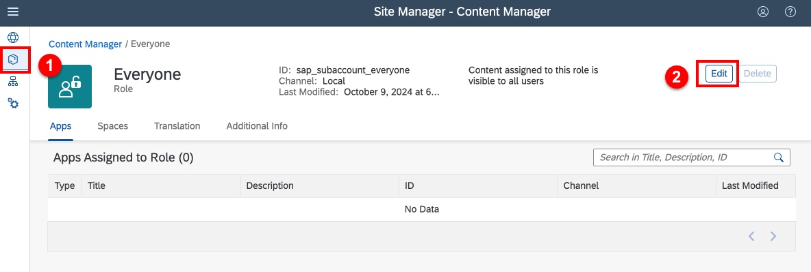

- Enable each of your applications

- Click **Save**

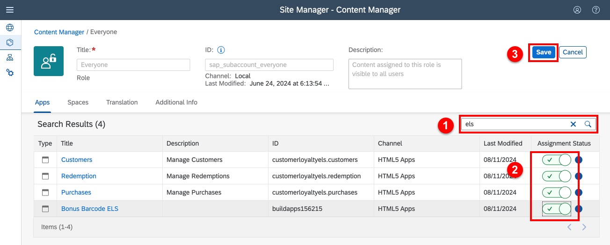

## Launch your app!

You're almost done! You can now access your new business site and launch your apps.

1. Launch your site

- Click the Site Directory Icon

- Click the launch icon on the Customer Zone site tile.

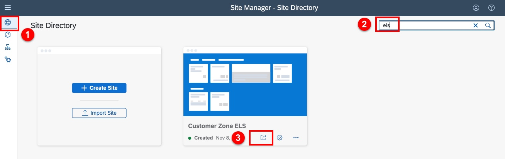

2. You can now launch each of your apps. You could also customize these tiles with descriptions, and organize them into separate groups if you prefer.

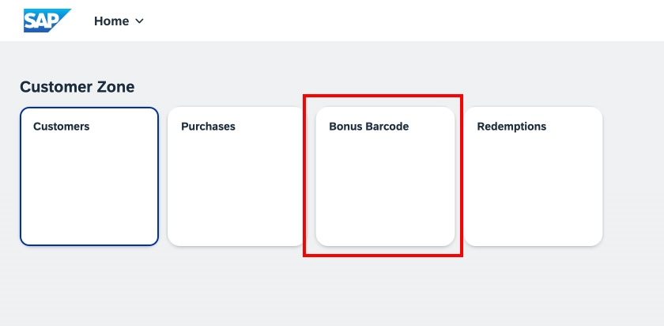

3. Here is your Customer Loyalty app running in the browser. Note that the barcode scanner won't be availble in the browser, so you would have to enter a customer number manually to test.

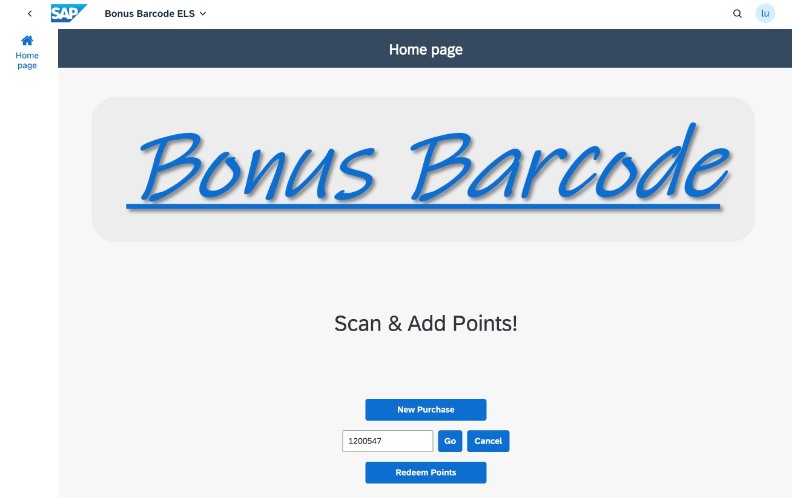

## Congratulations!

You have completed this tutorial!