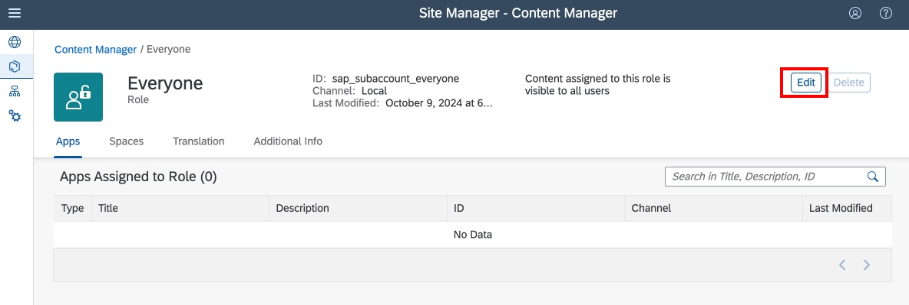

# Configure a business site and access your app

## Access Work Zone from the SAP Build Lobby

1. Return to the [SAP Build Lobby](https://lcapteched.eu10.build.cloud.sap/lobby)

2. From the Lobby, select **Create** from the drop-down menu.

3. Select **Build a Business Site**

4. Select **Configure Site in Admin Console**. Note that the Manage Workpages and Workspaces option in unavailable. This option is available when SAP Build Work Zone, advanced edition is enabled. We will be using Work Zone, standard edition.

5. Log in using your assigned user ID and password

## Create a new business site for your app

1. Create a new business site for this app.

- Click **Create Site**

2. Enter a name for your site:

- Name your site **Customer Zone XXX** (XXX is your user number)

- Click **Create**

3. The new site settings will be displayed. We do not need to change these. Just click the back arrow on the top left corner of the page.

## Make your app available in Work Zone

There are a few steps to register your new app, to make it available Work Zone.

1. Refresh the HTML5 application channel connector:

- Select the Channel Manager icon

- Click the Refresh icon

- Wait a few moments for the status to change to **Updated**

2. Access the Content Explorer

- Select the Content Manager icon

- Click **Content Explorer**

3. Click on the **HTML5 Apps** tile to browse the available HTML5 apps.

4. All of the apps you have developed in this exercise are included here. Let's enable all of them.

- Enter your user number in the search field, and click the search icon

- Select each app -- **Customers**, **Redeptions**, **Purchases**, and **Bonus Barcode XXX**

- Click **Add**

- Click the Content Manager cookie crumb to go back

5. Now we can include these in an application group.

- Select the Content Manager icon

- Click **Create** and select **Group**

6. Configure the group:

- Give the group a name, such as **Customer Zone XXX** (XXX is your user number)

- Enter your user number in the search field and click the search icon

- Click the toggle to enable each of your apps

- Click **Save**

- Click on the Content Manager cookie crumb to return

7. Make the apps available to all users (the Everyone group)

- Click the Content Manager icon

- Select the **Everyone** group object

- Click **Edit** to edit the group

- Search for your intitials

- Enable each of your apps

- Click **Save**

## Launch your app!

You're almost done! You can now access your new business site and launch your apps.

1. Launch your site

- Click the Site Directory Icon

- Enter your user number in the search bar

- Click the launch icon on the Customer Zone site tile.

2. You can now launch each of your apps. You could also customize these tiles with descriptions, and organize them into separate groups if you prefer.

3. Here is your Customer Loyalty app running in the browser. Note that the barcode scanner won't be availble in the browser, so you would have to enter a customer number manually to test.

## Congratulations!

You have completed this tutorial!