# Setup SAP HANA Cloud Trial

## Setup SAP HANA Cloud service instance 

1. If you've closed the BTP Cockpit, see these instructions to navigate back in a new tab: [Accessing your BTP trial account, subaccount, and the SAP Build Lobby](../lobbyaccess/).

2. From your subaccount, create a SAP HANA instance:

- Select **Service Marketplace**

- Search for **HANA**

- On the tile for **SAP HANA Cloud** click the 3 dots **...** menu

- Click **Create**

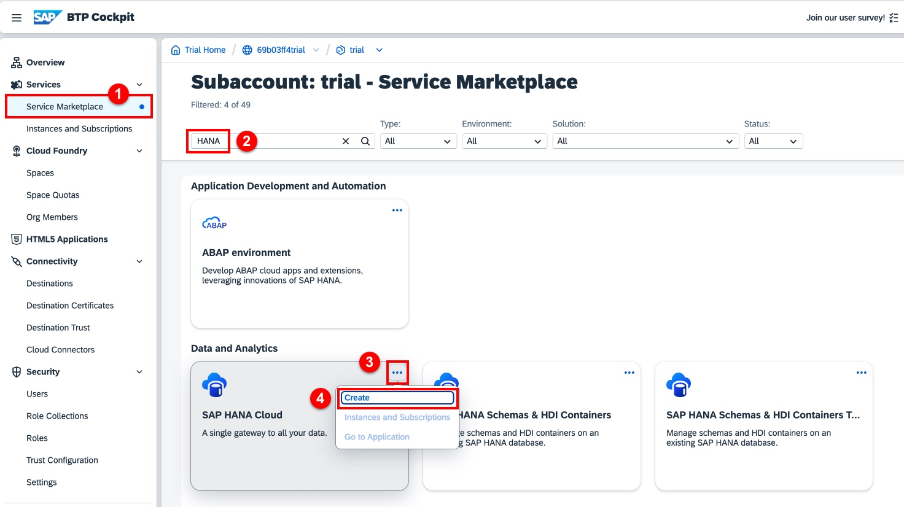

3. Provide the parameters for the service instance:

- Make sure that the **SAP HANA Cloud** service is selected

- Open the dropdown for the plan

- Select **Subscription > tools** for the service plan

- Clilck **Create**

- You may navigate to **Services and Instances** to validate the service creation. It should not take very long.

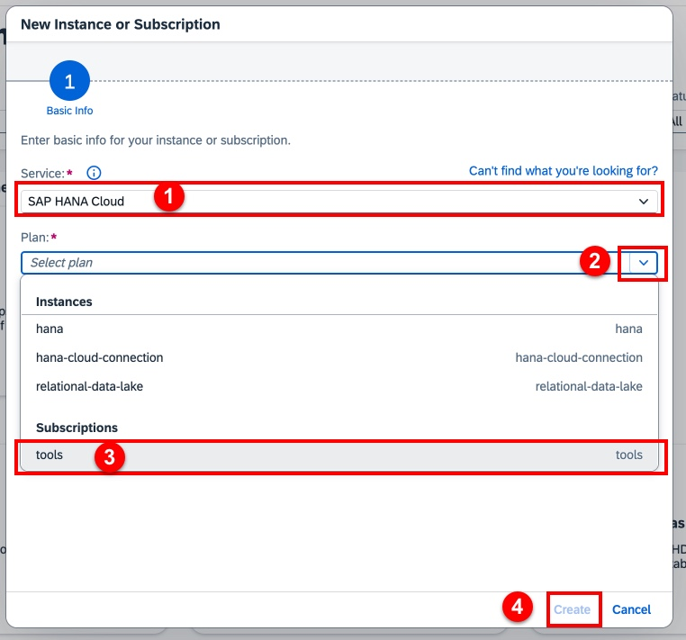

4. Add the database admin role collection to your user. Note that we are adding the role to your user using the **Default identity provider**.

- Select **Security > Users**

- Click on your user row. Ensure that you select the row with the **Default identity provider**.

- On the overview, under **Role Collections**, select the drop down menu and click **Assign Role Collection**

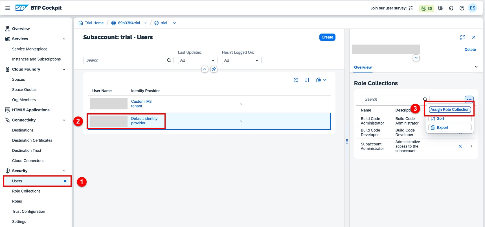

5. Assign the role collection to your user:

- Enter **hana** in the search field

- Select the **SAP HANA Cloud Administrator** role collection

- Click **Assign Role Collection**

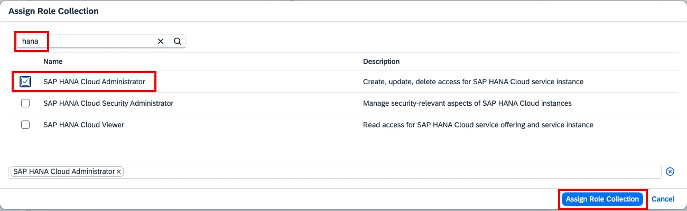

## Create a database

1. Navigate to **Cloud Foundry > Spaces** and select the **dev** tile. Your dev space will open.

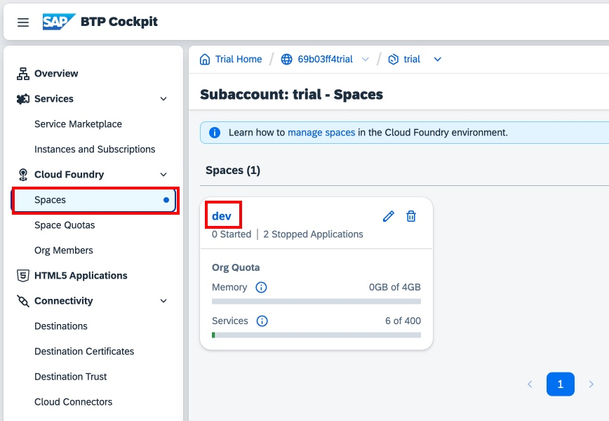

2. Launch SAP HANA Cloud Central, Cloud Foundry edition:

- Navigate to **SAP HANA Cloud**. You may disregard the warning about deprecation of the service.

- Click on the **...** drop-down menu on the upper right.

- Select **SAP HANA Cloud Central, Cloud Foundry edition**

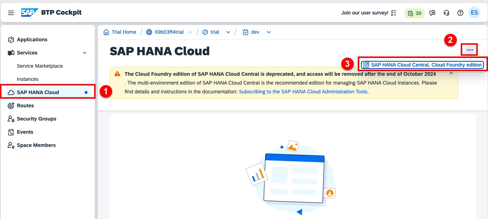

3. If prompted, sign in to continue.

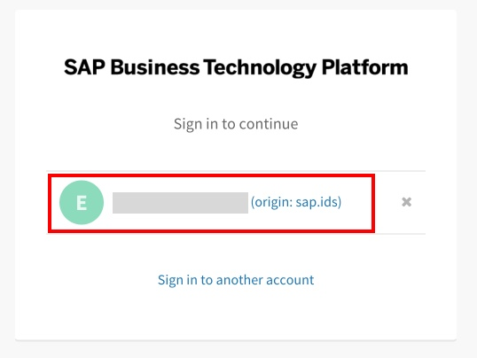

4. In SAP HANA Cloud Central, select **Create Instance**. As before, you may disregard the deprecation warning.

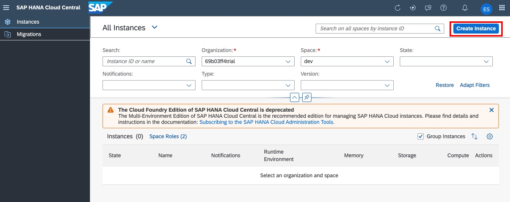

6. On the database Type screen, select **SAP HANA Cloud, SAP HANA Database**, and click **Next Step**

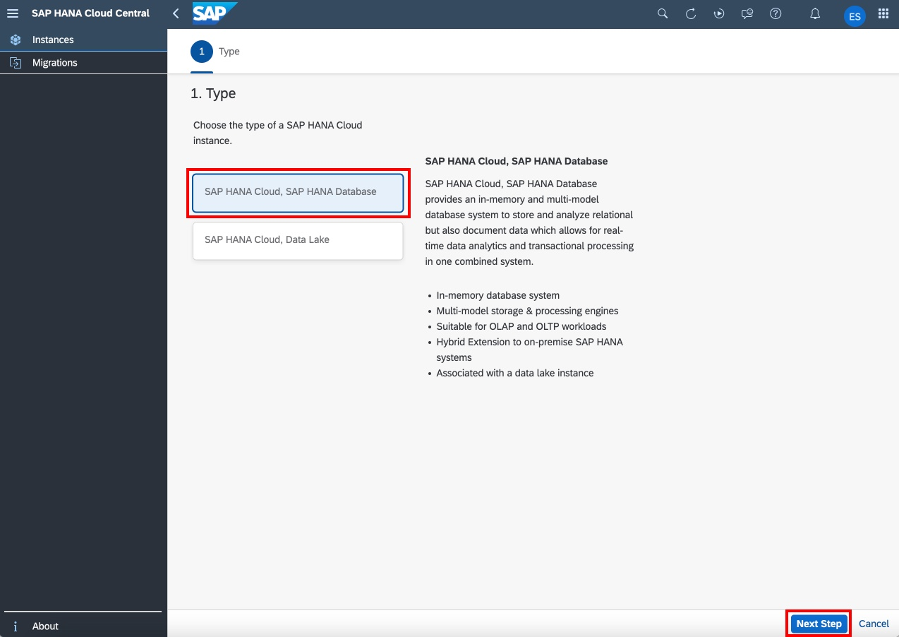

7. On the General settings screen, your Organization and Space should already be set.

- In the **Instance Name** field enter **hana-db**

- Enter and confirm a password for the DBADMIN user. You should not need to use this user in this tutorial.

- Click **Next Step**

- On the next screen (SAP HANA Database), leave the default memory setting and click **Next Step**

- On the next screen (SAP HANA Database Availability Zone and Replicas), click **Next Step**

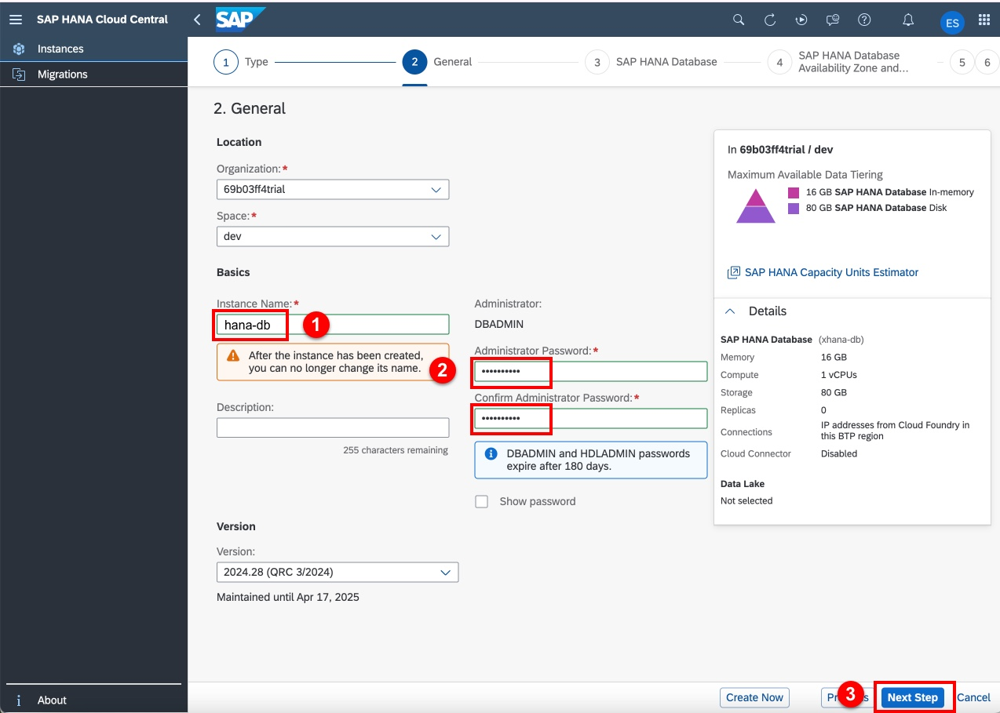

6. On the SAP HANA Database Advanced settings screen:

- Under Allowed Connections, select **Allow All IP Addresses**. Note that the deploy will fail without this setting.

- Click **Next Step**

- On the next screen (Data Lake), click **Review and Create**

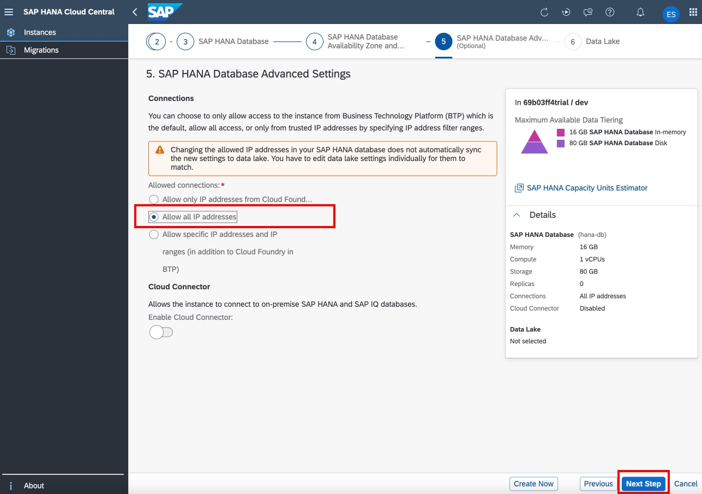

7. On the New Instance review screen, click **Create Instance**

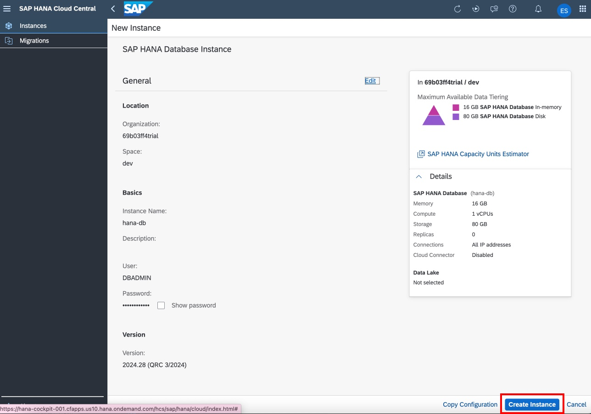

8. It may take up to ten minutes for the database creation to complete. You can occasionally refresh the browser window to check the status.

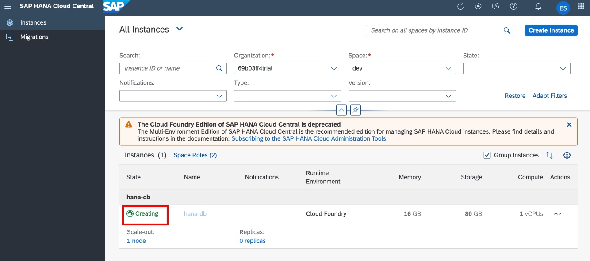

9. The database will indicate **Running** when ready.

## [Return to Exercise ⎘](../ex2/)