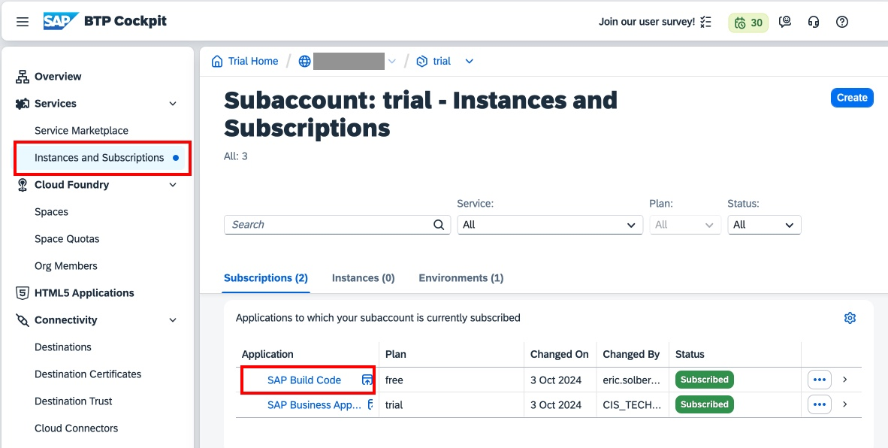
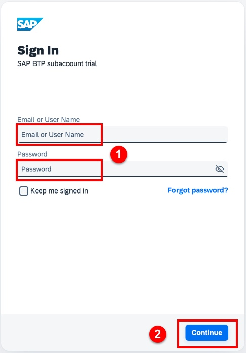
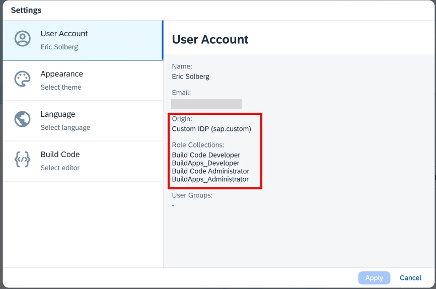

# Accessing your BTP trial account, subaccount, and the SAP Build Lobby

All of the tools in this tutorial are accessed through the SAP Build Lobby. You will access the Lobby through your BTP trial subaccount.

> [!IMPORTANT]
> In this tutorial, you have two identities configured: 
> - The identity used to register at SAP.com and create your trial subaccount (the default identity provider). You will use this identity to log into the SAP BTP Cockpit. 
> - The identity created for SAP Build Apps (the custom identity provider). You will use this identity to log into the SAP Build Lobby.
> 

## Access your subaccount

1. To access your BTP trial subaccount, navagate to the [SAP BTP Trial Home](https://cockpit.hanatrial.ondemand.com/trial/#/home/trial)
 
2. If not logged in, log in with the email and password you used when you registered at SAP.com (default identity)
 
3. To access your trial account, click **Go To Your Trial Account**

4. To access your trial subaccount click the **trial** sub-account tile

## Access the SAP Build Lobby

1. From your subaccount, select **Instances and Subscriptions**

2. Select SAP Build Code to launch the SAP Build Lobby

3. Log in with the custom identity provider (if not already logged in)

- If you are presented with a screen to choose the identity provider, select the custom identity provider.

- Log in with the user name and password you used to setup the custom identity provider.

## Verify your identity (optional)

You can ensure that you are logged in with the custom identity provider and have the proper role assignments.

1. From the Lobby, select your profile icon on the upper right corner of the screen

4. The **Origin** should identify the **Custom IDP (sap.custom)**. The **Role Collections** should list **Build Code Developer**, **BuildApps_Developer**, **Build Code Administrator**, and **BuildApps_Administrator**.

5. If you are't logged in with the custom identity provider, you may log out and log back in. When you log in, select your custom identity provider. Similarly, if you are asked to log into the Lobby, or any of the SAP Build tools launched from the lobby, be sure to select the custom identity provider.

You can press the browser back button to return to your current tutorial step.