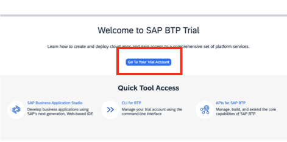
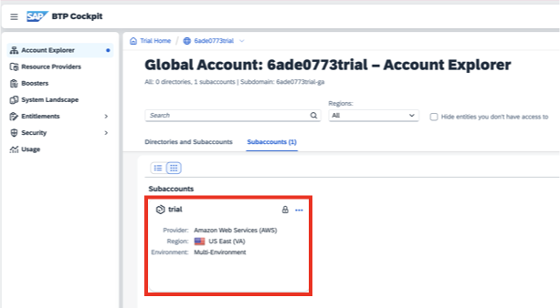

# Accessing your BTP trial account and the SAP Build Lobby

All of the tools in this tutorial are access through the SAP Build Lobby. You will access the Lobby through your BTP trial subaccount.

## Access your subaccount

### Important

In this tutorial, you have two identities configured: 

- The identity used to register at SAP.com and create your trial subaccount (the default identity provider). You will use this identity to log into the SAP BTP Cockpit.

- The identity created for SAP Build Apps (the custom identity provider). You will use this identity to log into the SAP Build Lobby.

1. To access your subaccount, navagate to the [SAP BTP Trial Home](https://cockpit.hanatrial.ondemand.com/trial/#/home/trial)

2. If not logged in, log in with the email and password you used when you registered at SAP.com 

3. Select **Go To Your Trial Account**

4. Select the tile for your trial account

## Access the SAP Build Lobby

1. From your subaccount, select **Instances and Subscriptions**

2. Select SAP Build Code to launch the SAP Build Lobby

You can press the back button to return to your current tutorial step.