# Set Up SAP Build Apps on SAP BTP Trial Account

## Install SAP Cloud Identity Service

1. SAP Build Apps requires that users be part of a custom identity provider. Therefore, you need to install the Cloud Identity Service.

- In the cockpit of your subaccount, go to **Service Marketplace**.

- Search for **Cloud Identity Service**.

- Click the **Cloud Identity Service** tile.

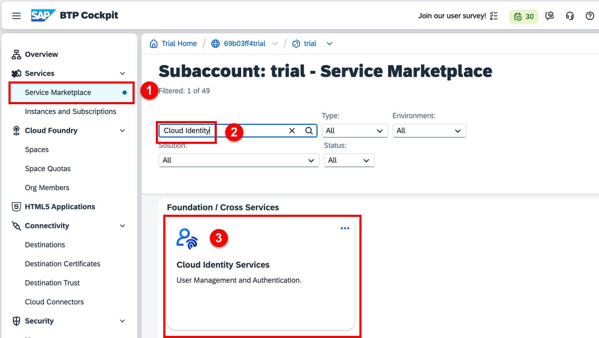

2. To create an instance of the Cloud Identity Service, click **Create**.

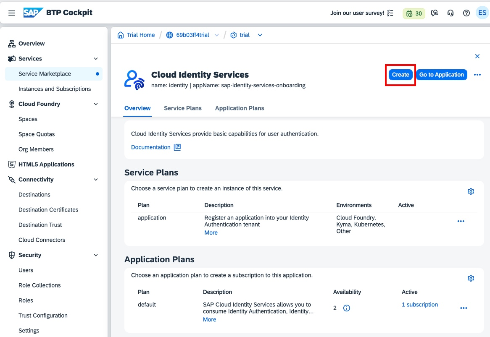

3. Create a subscription to the default service plan:

- Select the dropdown to select the plan

- Select the **default** subscription.

- Click **Create**

- The service will be created in a few seconds.

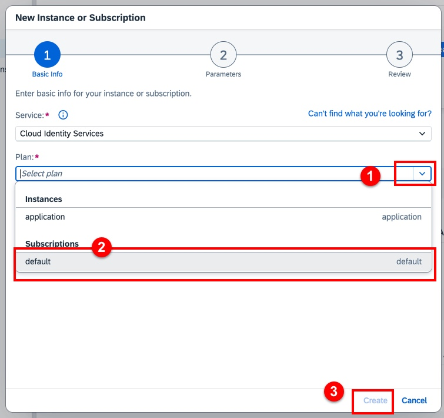

4. You will get an email to activate your account on this new identity provider.

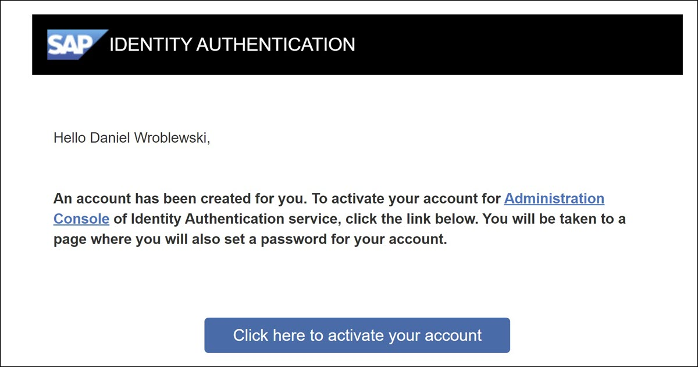

4.  Click the button to activate your account, and follow the
    instructions for creating a password for this new custom identity
    provider.

When you are done you will see a new browser tab with the administration
UI for managing users and authorizations for this identity provider.
There is nothing to be done on this screen.

## Establish trust

1.  Navigate back to your subaccount.

You can navigate back by doing the following:

- Click the global account in the breadcrumb.

- Click **Account Explorer**.

- Click your subaccount.

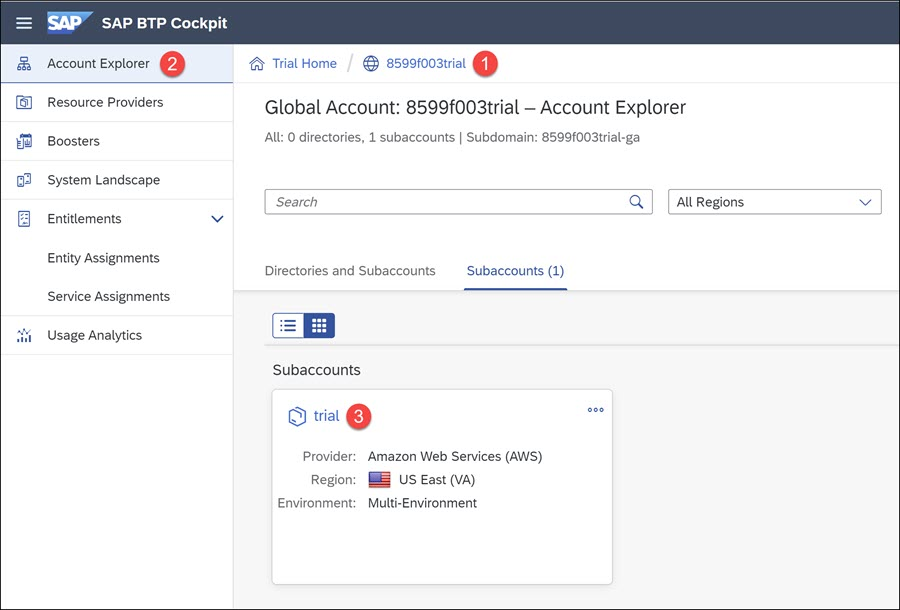

2.  In the cockpit of your subaccount, go to **Security \> Trust
    Configuration**.

Click **Establish Trust**.

You should see the identity provider you created when you install the
Cloud Identity Service.

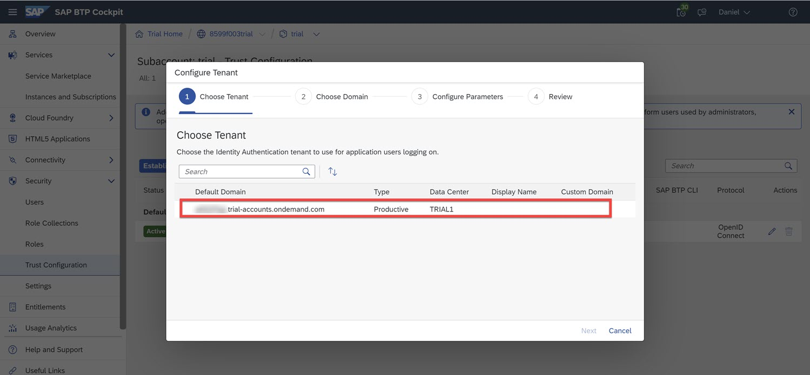

Select it, and click **Next**.

3.  On the **Choose Domain** page, keep the settings and click **Next**.

On the **Configure Parameters** page, keep the settings and
click **Next**.

Click **Finish**.

You should now have a custom identity provider in the trust
configuration.

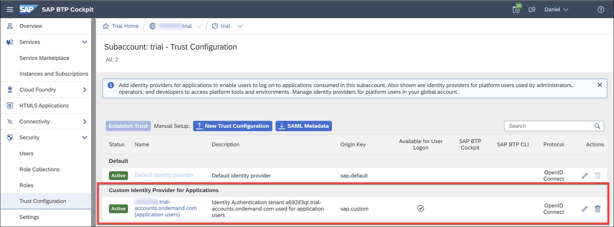

## Run the SAP Build Apps Booster

1. Launch SAP Build Apps Booster by

- Navigate back to the global account by clicking on the global account in the breadcrumb.

- Click **Boosters** on the global account menu

- Search for **Build Apps**

- Click on the tile **Get Started with SAP Build Apps- Detailed Account Setup**

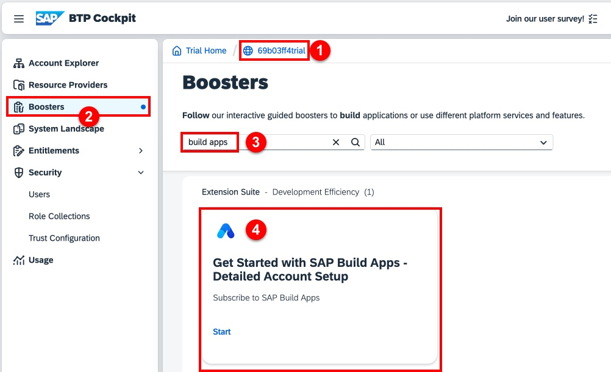

2. Click **Start** to run the booster

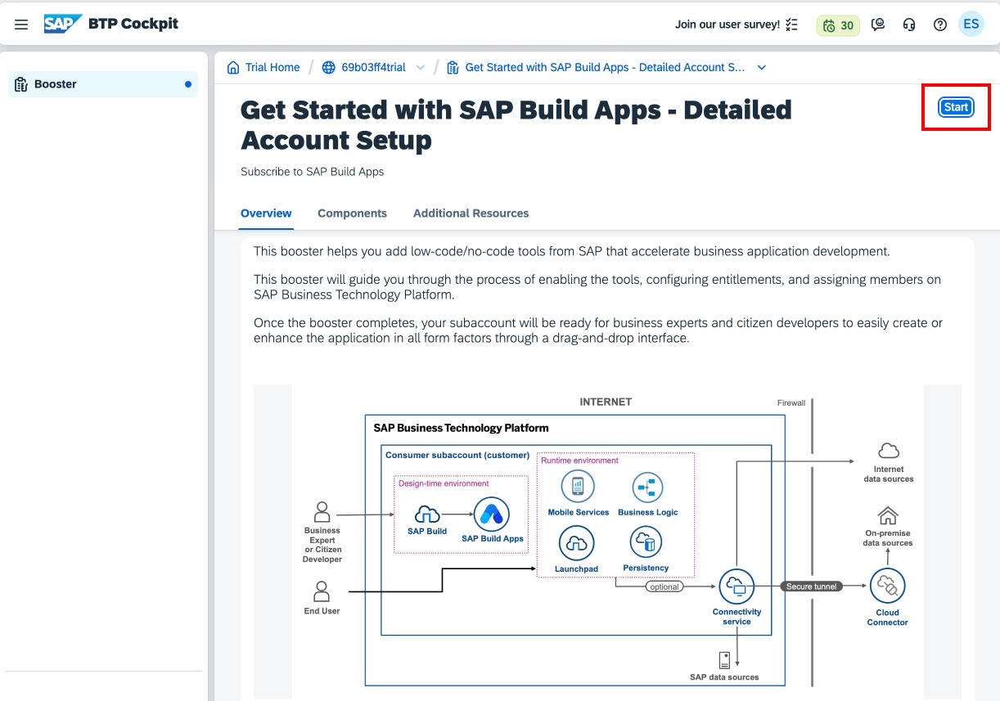

3. The next screen will quickly check requirements. Click **Next** once complete.

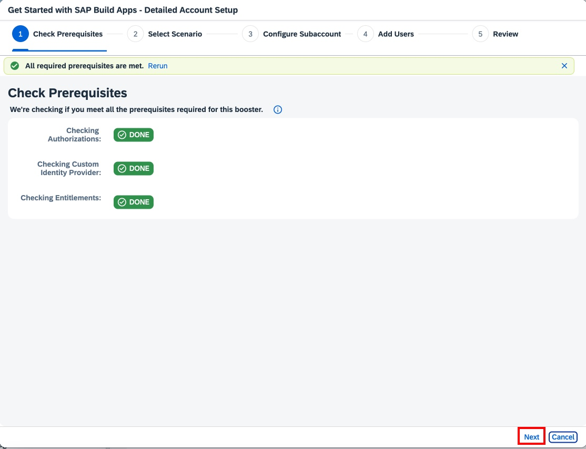

4. Choose the option **Select Subaccount** then click **Next**

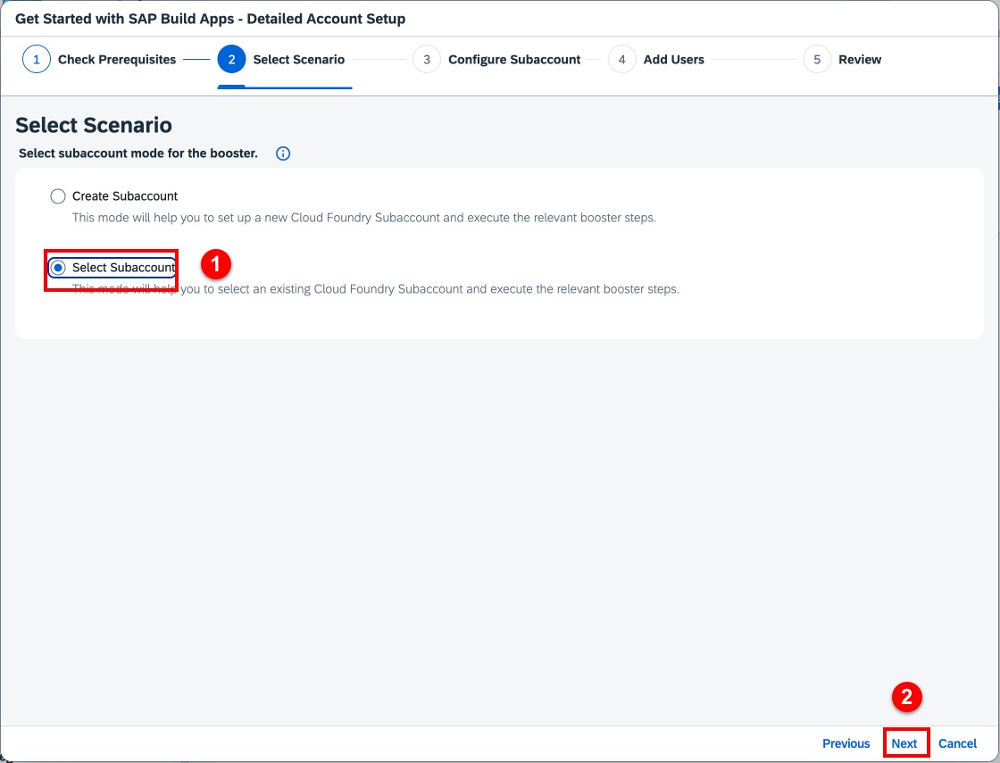

5. Keep the defaaults on the Configure Subaccount screen, and click **Next**.

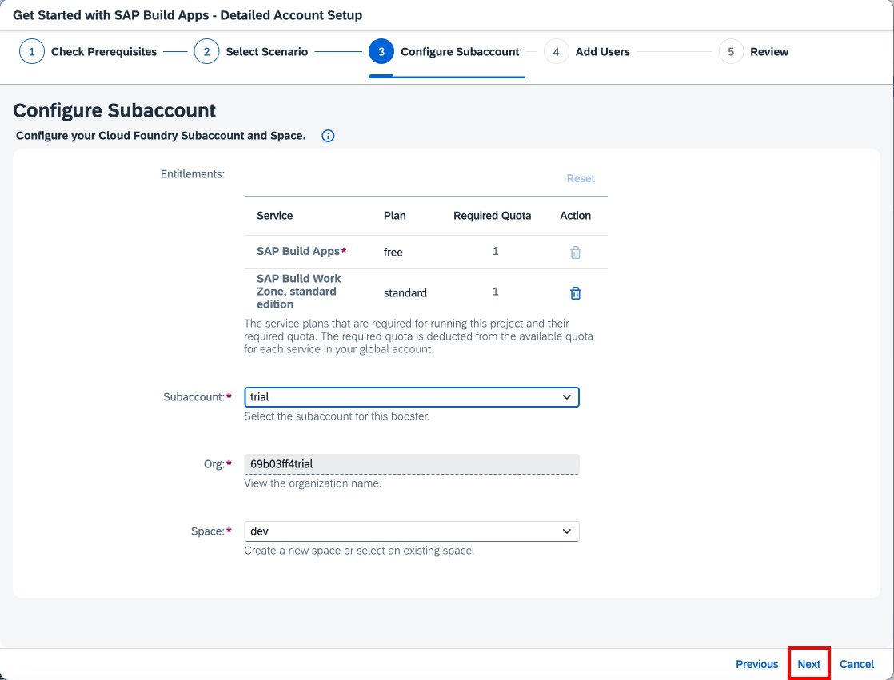

6. Keep the defaults on the Add Users screen, and click **Next**. Your user ID will automatically be added.

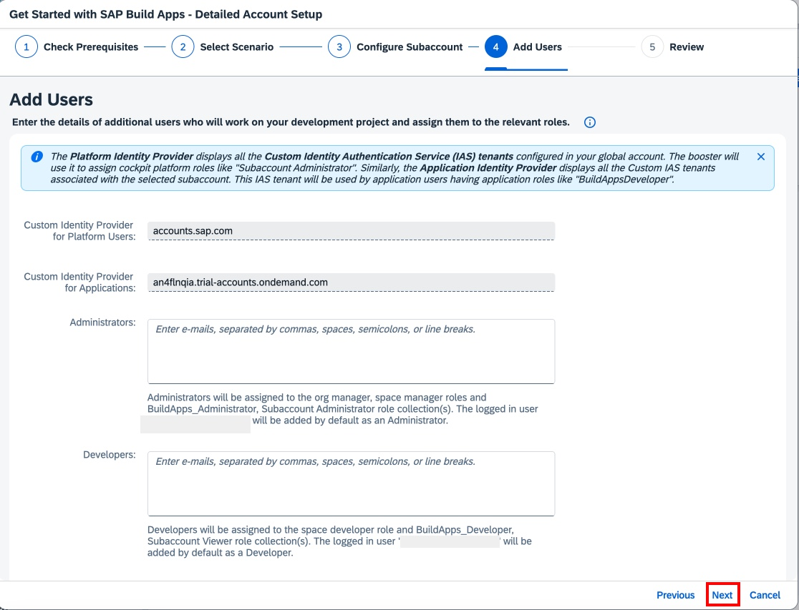

7. Review the configuration and click **Next** to provision SAP Build Apps.

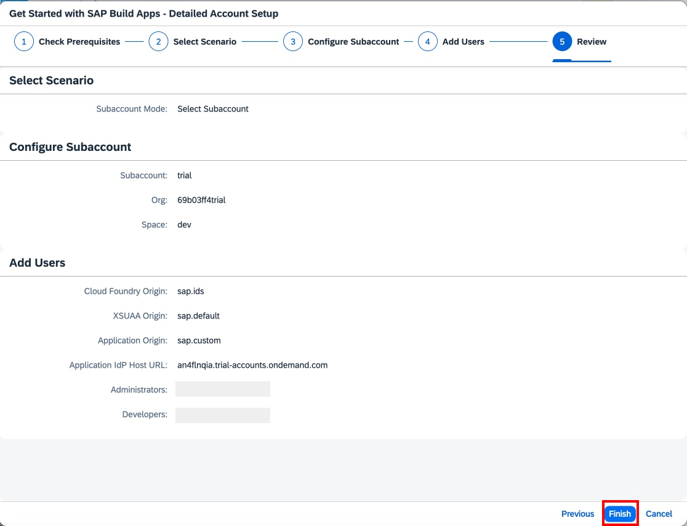

8. It will take a few minutes for the provisioning process to complete.

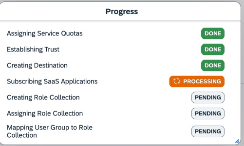

9. Once completed, click **Navigate to Subaccount**

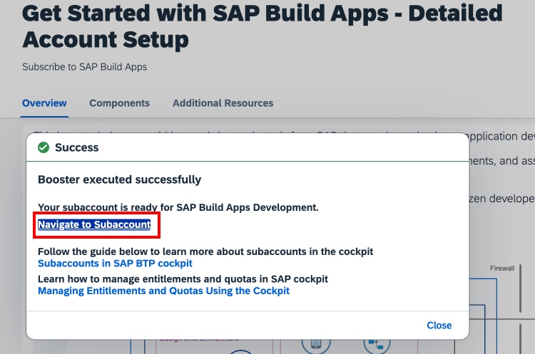

## Add Build Code Role Collections

So that you can access both SAP Build Code and SAP Build Apps using the identity you created in Step 1, we will add the SAP Build Code role collections to your user.

1. On the subaccount menu:

- Under **Security**, click on **Users**

- Click on your user name for the **Custom IAS Tenant**. The user configuration will open either to the right, or below the user list.

- Scroll down to **Roll Collections** and click on the button with three dots **...**

- Click on **Assign Role Collections**

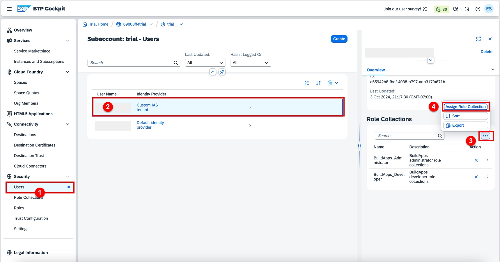

2. In the **Assign Roles** dialog:

- Search for **Build**

- Select both **Build Code Administrator** and **Build Code Developer**

- Click **Assign Role Collection**

You have now installed SAP Build Apps with a custom identity provider, and assigned the Build Code roles to the new identity. You may now continue with the main exercise.

## [Next Lesson ⎘](../ex0/)